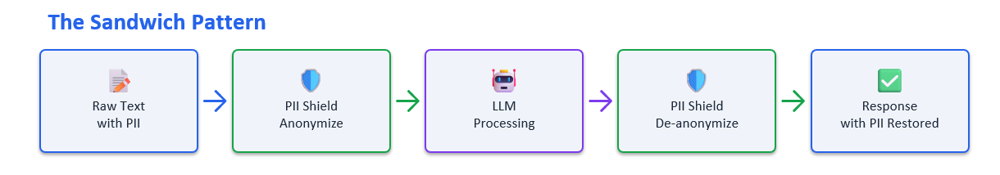
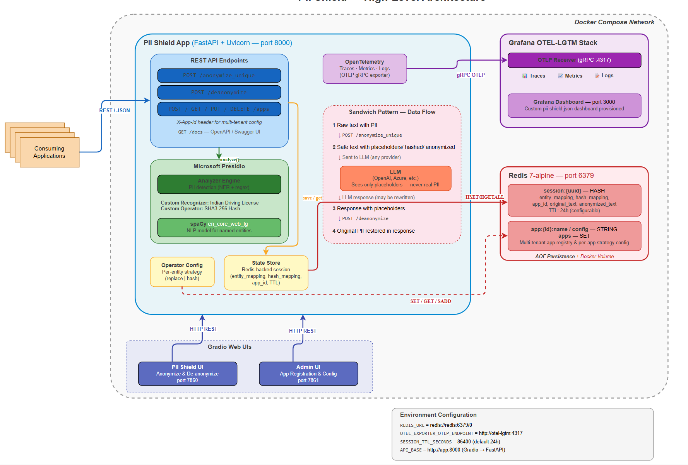
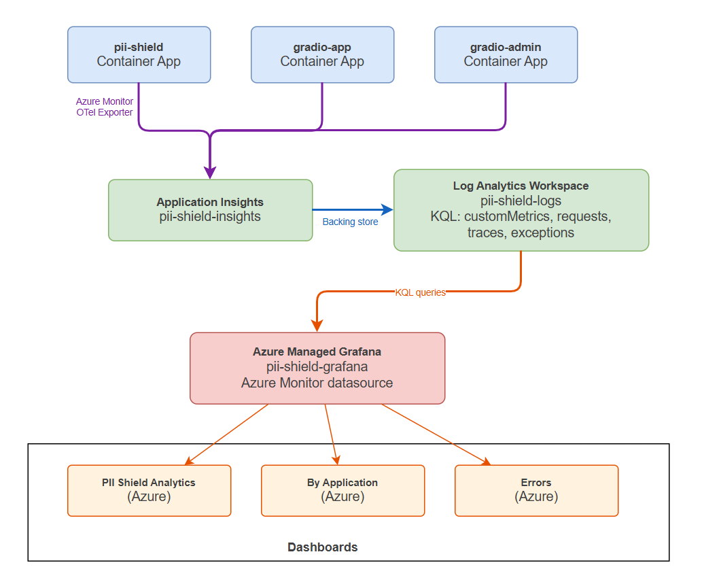
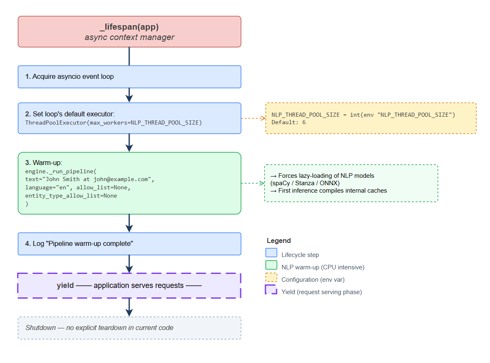
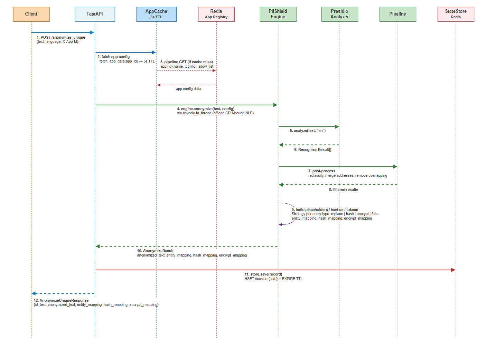
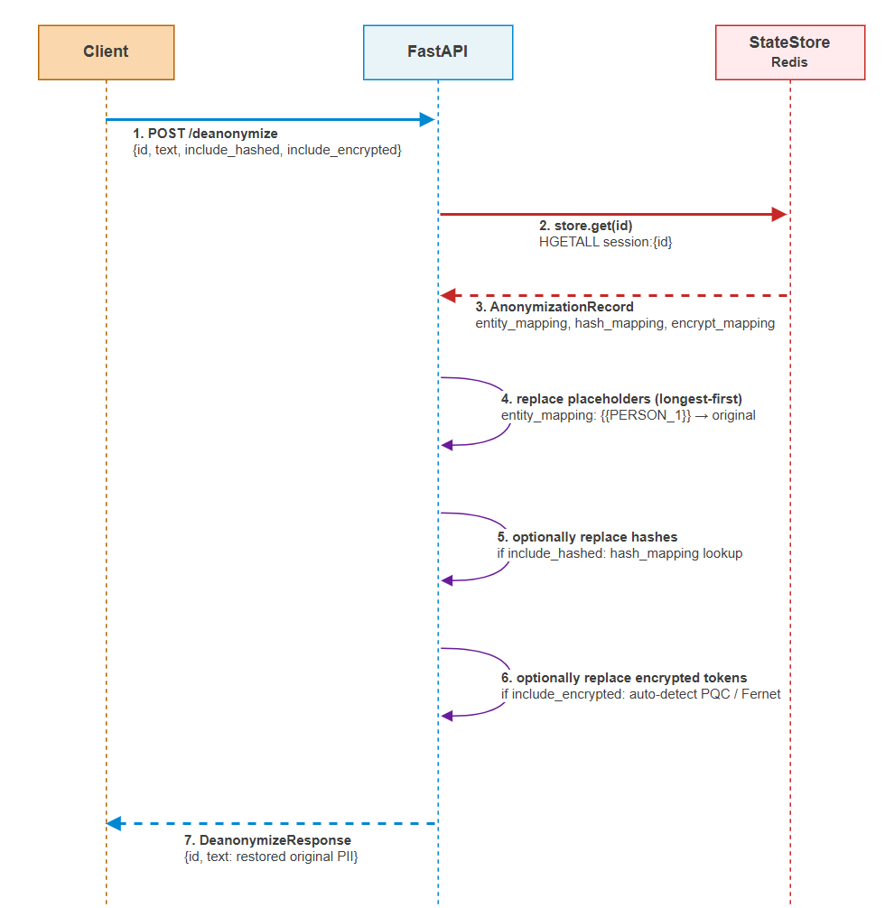
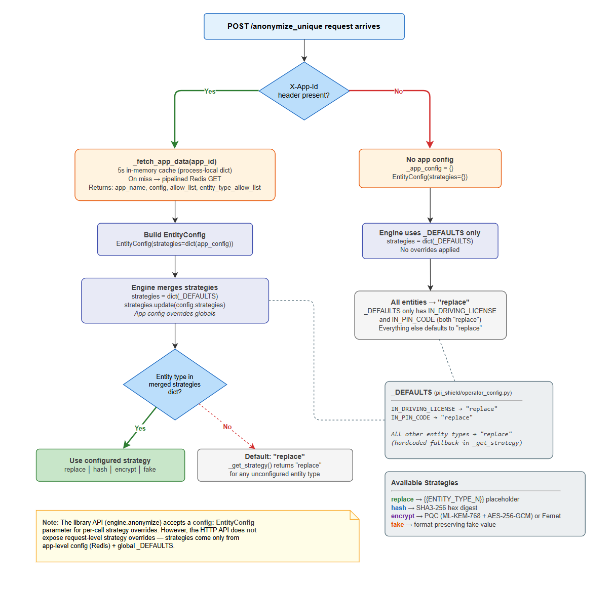
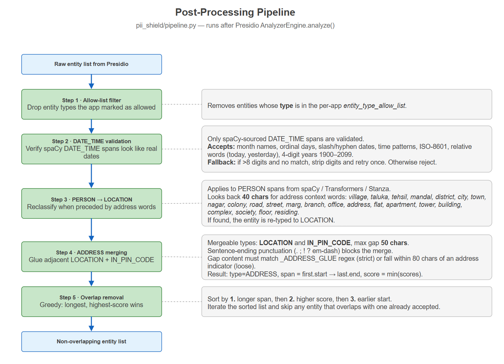

# PII Shield — Design Document

> *Version 0.3.0 \| Last updated: April 2026*

## 1. Introduction

### 1.1 Purpose

PII Shield is an intelligent anonymization layer designed to sit between AI-powered applications and Large Language Models (LLMs). Built on <u>Microsoft Presidio</u>, it detects personally identifiable information (PII) in free-form text, applies configurable anonymization strategies — replace, hash, encrypt, or fake — and enables fully reversible de-anonymization via a secure session store. The system ships as both a standalone Python library (pii_shield) for direct embedding and a FastAPI REST service (app/) for network-accessible deployments, each optimized for different integration patterns.

PII Shield addresses a critical gap in LLM-based architectures: ensuring that sensitive personal data never reaches third-party inference endpoints. By intercepting text before and after LLM processing, it enforces data-minimization principles without requiring changes to the LLM itself or the consuming application's core logic.

### 1.2 The Sandwich Pattern

The core architectural concept is the **Sandwich Pattern** — PII Shield wraps the LLM interaction in a two-phase anonymize/deanonymize cycle so that the model processes only sanitized text:

The LLM never sees real PII — only opaque placeholders like {{PERSON_1}}, SHA3-256 hashes, or encrypted tokens (ML-KEM-768 + AES-256-GCM by default, or legacy Fernet). The de-anonymization step is resilient to LLM-modified text: only the embedded placeholders, hashes, or encrypted tokens are substituted back, leaving any rewritten surrounding prose intact.

**Key properties of the Sandwich Pattern:**

| **Property** | **Description** |
|----|----|
| Transparency | Consuming applications make two HTTP calls — the anonymization and de-anonymization logic is fully externalized. |
| LLM-agnostic | Any model that preserves placeholder tokens in its output is compatible. No model fine-tuning or prompt engineering required. |
| Strategy-flexible | Different entity types can use different strategies within the same request (e.g., ***replace*** for names, ***hash*** for emails, ***encrypt*** for Aadhaar numbers). |
| Session-scoped | Each anonymization call produces a UUID-keyed session containing the full entity mapping. Sessions auto-expire via configurable TTL (default: 86400 seconds = 24 hours, configurable via SESSION_TTL_SECONDS env var). |

### 1.3 Scope

**In scope:**

| **Component** | **Description** |
|----|----|
| FastAPI REST service (app/) | Full-featured HTTP API with Redis-backed session storage, multi-tenant application registry, Streamlit web UIs (user-facing playground and admin), OpenTelemetry observability, and SQLite-based audit logging. |
| Standalone Python library (pii_shield/) | Importable package providing PiiShieldEngine for single-text anonymization, BatchProcessor for CSV/DataFrame/text-list bulk processing, and pluggable mapping stores (InMemory, SQLite, JsonFile). No Redis, no FastAPI, no Docker dependency. |
| Custom Indian PII recognizers | Purpose-built recognizers for Aadhaar, Driving License, PIN Code, Phone Number, UPI ID, and natural date expressions — shared between both packages. |
| Custom operators | SHA3-256 hash, post-quantum encryption (ML-KEM-768 + AES-256-GCM), Fernet encryption, and synthetic fake-data generation operators. |
| Batch processing | Thread- and process-parallel processing of text lists, CSV files, and pandas DataFrames via BatchProcessor. |
| Infrastructure | Docker Compose for local development (Redis, Grafana LGTM, Streamlit UIs). Terraform IaC + shell scripts for Azure Container Apps, Azure Cache for Redis, ACR, Application Insights, and Managed Grafana. |
| Observability | OpenTelemetry traces, metrics, and logs with dual-backend support — OTLP gRPC (local) and Azure Monitor (production). Pre-built Grafana dashboards for both environments. |

**Out of scope:**

| **Concern** | **Rationale** |
|----|----|
| Authentication / authorization middleware | Expected to be handled by a reverse proxy (e.g., nginx, Azure Container Apps ingress, API gateway). PII Shield does not enforce identity or access control. |
| HTTPS termination | TLS is terminated at the infrastructure layer (nginx, Azure Container Apps built-in HTTPS, load balancer). The application listens on plain HTTP. |
| Rate limiting | Not built-in. Recommended approach: add slowapi middleware or enforce at the reverse proxy / API gateway level. |
| PII detection model training | PII Shield uses pre-trained NLP models (spaCy, Stanza, Transformers, ONNX). Custom model training is outside the scope of this system. |

### 1.4 Intended Audience

This document is intended for:

- **Software developers** integrating PII Shield into LLM-based applications, either via the REST API or the Python library.

- **Solution architects** evaluating PII Shield's fitness for enterprise privacy requirements and designing deployment topologies.

- **DevOps / platform engineers** responsible for containerized deployment, infrastructure provisioning, and observability pipeline configuration.

- **Security reviewers** assessing the system's data handling, encryption posture, session management, and attack surface.

### 1.5 Related Documents

| **Document** | **Location** | **Description** |
|----|----|----|
| Prerequisites Guide | docs/prerequisites.md | Complete list of software, NLP models, environment variables, Azure roles, and RBAC requirements. |
| Azure Deployment Guide | infra/README.md | Step-by-step instructions for Terraform provisioning, ACR builds, Container Apps deployment, and Grafana dashboard setup. |
| Architecture Diagrams | docs/architecture.drawio | draw.io component diagram — local Docker Compose topology. |
| Azure Architecture Diagram | docs/architecture-azure.drawio | draw.io deployment diagram — Azure Container Apps, Redis, ACR, App Insights, Managed Grafana. |
| Project README | README.md | Quick-start guide, API usage examples, library usage, and Docker setup instructions. |

## 2. Assumptions & Constraints

### 2.1 Assumptions

| **\#** | **Assumption** | **Impact** |
|----|----|----|
| A1 | **Python 3.10+** runtime is available in all deployment environments. The library uses match statements, type union syntax (X ,Y), and typing features introduced in 3.10. |  |
| A2 | **Redis 7.x** is available and reachable for service mode (app/). Redis is used for session storage (anonymization records with TTL) and the multi-tenant application registry. | Library mode (pii_shield/) does not require Redis — it uses in-memory, SQLite, or JSON file mapping stores. |
| A3 | **NLP models must be downloaded separately** after package installation. Models are not bundled in the wheel file. This is automatically handled in the docker build approach. | Internet access is required at setup time. The Docker build automatically downloads the model specified by the NLP_ENGINE build argument. |
| A4 | **Docker and Docker Compose V2** are available for containerized local development. | The docker-compose.yml orchestrates five services: app, redis, otel-lgtm, playground (Streamlit), admin (Streamlit). |
| A5 | **Azure subscription** is available for cloud deployment (optional). Terraform provisions all required Azure resources. | Local-only deployments via Docker Compose are fully supported without Azure. |
| A6 | **English-language text** is the primary input. All NLP models and recognizers are tuned for English with Indian-context PII entities. | The ***language*** parameter defaults to "en". Other languages may work with reduced accuracy depending on the NLP model. |

### 2.2 Constraints

| **\#** | **Constraint** | **Mitigation** |
|----|----|----|
| C1 | **No HTTPS termination:** The FastAPI server listens on plain HTTP (port 8000). | TLS is handled by infrastructure: nginx, Azure Container Apps built-in HTTPS, or a cloud load balancer. |
| C2 | **No rate limiting:** High request volumes could exhaust NLP thread pool or Redis connections. | Add a middleware for per-client rate limiting or enforce limits at the reverse proxy / API gateway. |
| C3 | **Indian PII focus:** Non-India country-specific recognizers (US, UK, SG, AU) are removed at startup to reduce false positives on Indian data. | If multi-country support is needed, the recognizer filtering logic in ***PiiShieldEngine*** must be modified to retain the relevant recognizers. |
| C4 | **Session data is volatile**: In library mode, mappings are held in an in-memory dict (lost on process restart). In service mode, Redis sessions have a configurable TTL (default: 86400 seconds = 24 hours, configurable via SESSION_TTL_SECONDS env var). | For library mode, use SqliteMappingStore or JsonFileMappingStore for persistence. For service mode, configure Redis AOF persistence and adjust SESSION_TTL_SECONDS. |
| C5 | **Single-region deployment**: The Terraform configuration provisions resources in a single Azure region. | Multi-region HA requires duplicating the Terraform modules with region-specific backends and a global load balancer (e.g., Azure Front Door). |

### 2.3 Design Decisions

| **\#** | **Decision** | **Rationale** |
|----|----|----|
| D1 | **UUID-keyed session store** — in-memory ***dictionary*** for library mode, ***Redis HASH*** with TTL for service mode. | Zero external dependencies for library mode with sub-microsecond lookups. Redis provides persistence, TTL-based auto-expiry, and horizontal scalability for service mode. Trade-off: in-memory data is lost on restart in library mode. |
| D2 | **Separate /anonymize_unique and /deanonymize endpoints** — decoupled request/response lifecycle. | Supports the LLM pipeline sandwich pattern where an arbitrary amount of time (and processing) occurs between anonymization and de-anonymization. The client retains the session id and can call /deanonymize with LLM-modified text at any later point within the session TTL. |
| D3 | **Async Redis for hot path, sync for admin** — ***aioredis*** for /anonymize_unique and /deanonymize; synchronous redis-py for app registration CRUD. | Anonymization and de-anonymization are latency-sensitive hot-path operations that benefit from non-blocking I/O. App registration is infrequent and simpler with synchronous calls. The pipelined async fetch (\_fetch_app_data) replaces five separate Redis GET calls with a single round-trip. |
| D4 | **Longest-placeholder-first replacement** during de-anonymization. | Prevents {{PERSON_1}} from being matched and replaced inside {{PERSON_10}}. Sorting entity mapping keys by descending length guarantees correct, non-overlapping substitution. |
| D5 | **Strategy pattern for operators** — pluggable replace / hash / encrypt / fake strategies per entity type. | Allows fine-grained control: names can be replaced with placeholders (reversible), emails hashed (one-way), and government IDs encrypted (reversible with key). New strategies can be added by implementing the Presidio ***Operator*** interface. |
| D6 | **Multi-tenant per-app config** — each registered application gets its own per-entity strategy configuration stored in Redis. | Enables different consuming applications to apply different anonymization strategies to the same entity types. A customer-facing chatbot might use ***replace*** for all entities, while an analytics pipeline might use ***hash*** for emails and ***encrypt*** for Aadhaar numbers. Strategy resolution follows: app-specific config → global defaults. |
| D7 | **Post-quantum encryption default** — ML-KEM-768 (NIST FIPS 203) + AES-256-GCM for the ***encrypt*** strategy. | Provides future-proof security against quantum computing attacks (NIST Level 3). Each PII value gets its own KEM encapsulation, providing per-value forward secrecy. Legacy Fernet (AES-128-CBC + HMAC-SHA256) is retained as an alternative backend for environments that cannot install the keeper-mlkem dependency. Backend auto-detection on de-anonymization enables seamless migration. |
| D8 | **Recognizer filtering** — removes US, UK, SG, and AU country-specific recognizers at startup. | Prevents false positives on Indian data. For example, the NhsRecognizer (UK NHS numbers) matches 10-digit Indian mobile numbers; UsBankRecognizer matches Indian bank account numbers. Removing these recognizers at engine initialization eliminates an entire class of false positives without impacting Indian entity detection. |
| D9 | In-memory app-data cache with 5-second TTL on the hot path, cross-worker invalidation via Redis pub/sub. | Avoids repeated Redis round-trips for app configuration on every /anonymize_unique request. The cache stores the result of the pipelined Redis fetch and invalidates on config updates. When any Gunicorn worker updates app config, it publishes the app_id to a Redis pub/sub channel (pii-shield:cache-invalidate); all workers subscribe and evict the stale entry immediately. Max cache size of 1,000 entries with stale-entry eviction prevents unbounded memory growth. |
| D10 | **Thread pool for NLP inference** — configurable ***ThreadPoolExecutor*** (default: 6 workers) for asyncio.to_thread(). | ONNX Runtime allows multiple tasks to run at the same time without getting stuck, thanks to how it handles processing. Using a thread pool keeps NLP jobs from piling up and slowing things down, which helps avoid noticeable delays when the system is busy. |

## 3. High-Level Design

### 3.1 System Context

PII Shield serves as a central privacy intermediary within the LLM application ecosystem. It is strategically positioned to interface with four distinct categories of external actors, ensuring seamless and secure data flow across the system – as explained in the architecture diagram below.

**Interaction flows:**

| **Actor** | **Direction** | **Interface** | **Description** |
|----|----|----|----|
| Client Application | → PII Shield | POST /anonymize_unique | Submit raw text; receive anonymized text + session ID + entity mapping. |
| Client Application | → PII Shield | POST /deanonymize | Submit session ID + LLM-processed text; receive text with PII restored. |
| Client Application | → PII Shield | X-App-Id header | Optional multi-tenant routing — resolves app-specific anonymization strategies. |
| Admin User | → PII Shield | Streamlit Admin UI (port 7861) | Register applications, configure per-entity strategies, view registered apps. |
| End User | → PII Shield | Streamlit Playground UI (port 7860) | Interactive anonymize/de-anonymize text interface for demonstrations and testing. |
| PII Shield | → Redis | Session CRUD, App Registry CRUD | Stores anonymization sessions (HASH with TTL) and per-app configuration (STRING + SET). |
| PII Shield | → OTel Collector | OTLP gRPC (local) or Azure Monitor (production) | Exports traces, metrics, and logs for operational observability. |
| PII Shield | → SQLite | Audit log writes | Records administrative events (app registration, config updates, deletions) with timestamps. |

### 3.2 Component Overview

PII Shield is organized into two main packages with shared infrastructure code. The separation ensures the library can be installed as a lightweight pip package without pulling in FastAPI, Redis, Streamlit, or OpenTelemetry dependencies.

#### FastAPI Service (app/)

The service package provides the full HTTP API and associated runtime infrastructure:

| **Module** | **Responsibility** |
|----|----|
| main.py | FastAPI application factory, endpoint definitions, lifespan management (NLP warm-up, thread pool), in-memory app-data cache. |
| models.py | Pydantic request/response models (AnonymizeRequest, AnonymizeUniqueResponse, DeanonymizeRequest, DeanonymizeResponse, RegisterAppRequest, etc.). |
| redis_store.py | Synchronous Redis client for app registry CRUD. Connection pooling via redis.ConnectionPool. Monkeypatched with fakeredis in tests. |
| state_store.py | Async Redis-backed session store (AnonymizationRecord HASH with configurable TTL). Falls back to in-memory dict when Redis is unavailable. |
| audit_store.py | SQLite-based audit log for administrative events (app registration, config updates, deletions). |
| telemetry.py | OpenTelemetry SDK initialization with dual-backend auto-detection (Azure Monitor vs. OTLP gRPC). Configures TracerProvider, MeterProvider, and LoggerProvider. |
| streamlit_app.py | Streamlit web UI for end-user anonymize/de-anonymize operations. Connects to the FastAPI service via API_BASE. |
| streamlit_admin.py | Streamlit web UI for admin operations — app registration, config management, registered app listing. |
| recognizers/ | Backward-compatibility re-exports of custom recognizers (canonical code lives in pii_shield/recognizers/). |
| operators/ | Backward-compatibility re-exports of custom operators (canonical code lives in pii_shield/operators/). |

**REST API Endpoints:**

| **Endpoint** | **Method** | **Description** |
|----|----|----|
| /anonymize_unique | POST | Detect PII, apply per-entity strategy, store session, return anonymized text + mappings. |
| /deanonymize | POST | Restore original PII from session mapping. Supports include_hashed and include_encrypted flags. |
| /apps | POST | Register a new application with default config. Returns app_id. |
| /apps | GET | List all registered applications with their configurations. |
| /apps/{app_id} | GET | Get details and per-entity config for a specific application. |
| /apps/{app_id}/config | PUT | Update the anonymization strategy for a specific entity type within an app. |
| /apps/{app_id} | DELETE | Deregister an application (returns 204). |
| /apps/{app_id}/allow-list | GET/PUT | Read or set per-app allow-list (terms excluded from PII detection). |
| /apps/{app_id}/entity-type-allow-list | GET/PUT | Read or set per-app entity-type allow-list (entity types excluded from detection). |
| /supported-entities | GET | Return the list of PII entity types the analyzer can detect. |
| /audit-log | GET | Return audit log entries with optional app_id, action, and limit filters. |
| /health | GET | Liveness probe. |
| /docs | GET | Swagger UI — interactive API documentation (auto-generated by FastAPI). |

#### Standalone Library (pii_shield/)

The library package provides the core PII detection and anonymization engine without any network or infrastructure dependencies:

<table>
<colgroup>
<col style="width: 30%" />
<col style="width: 69%" />
</colgroup>
<thead>
<tr>
<th style="text-align: center;"><strong>Module</strong></th>
<th style="text-align: center;"><strong>Responsibility</strong></th>
</tr>
</thead>
<tbody>
<tr>
<td>engine.py</td>
<td><strong>PiiShieldEngine</strong> — core detection + anonymization engine. Wraps Presidio <strong>AnalyzerEngine</strong> and <strong>AnonymizerEngine</strong> with custom recognizer registration, recognizer filtering, and strategy-aware placeholder generation.</td>
</tr>
<tr>
<td>batch.py</td>
<td><strong>BatchProcessor</strong> — parallel batch processing for text lists, CSV files, and pandas DataFrames. Supports <strong>thread</strong> and <strong>process</strong> parallelism modes with configurable <strong>max_workers</strong>.</td>
</tr>
<tr>
<td>mapping_store.py</td>
<td>Pluggable persistence for entity mappings: <em><strong>InMemoryMappingStore</strong></em> (default), <em><strong>SqliteMappingStore</strong></em>, <em><strong>JsonFileMappingStore</strong></em>. Abstract <em><strong>MappingStore</strong></em> base class for custom implementations.</td>
</tr>
<tr>
<td>models.py</td>
<td>Data classes: <em><strong>AnonymizeResult</strong></em> (anonymized text + entity mapping + hash/encrypt mappings), <em><strong>DetectedEntity</strong></em> (entity type, text, score, position), <em><strong>EntityConfig</strong></em> (per-entity strategy configuration).</td>
</tr>
<tr>
<td>pipeline.py</td>
<td>
Shared post-processing logic:

<em><strong>normalize_case()</strong></em> / <em><strong>merge_recovered_results()</strong></em> - recover names from ALL-CAPS and all-lowercase text that cased NER models mislabel, truncate, or miss

<em><strong>split_at_line_breaks()</strong></em> - NER reads a line break as plain whitespace, so a name ending one line can swallow the next line's first word; NER spans are split so no entity crosses a line

<em><strong>prefer_line_context()</strong></em> - when a context-only ID (APAAR, PRAN, Customer ID) owes its score to a keyword on another line, a recognizer with its own keyword on the number's line decides the type

<em><strong>reclassify_person_as_location()</strong></em> - fixes spaCy misclassification of Indian places

<em><strong>reclassify_phone_as_bank_account()</strong></em> - a bare 10-digit number is both a valid Indian mobile and a bank account number; the nearest account/phone cue decides

<em><strong>extend_person_over_initials()</strong></em> - dotted initials end the entity in cased NER models, so "Mr. R.K. Sharma" would otherwise leak the surname

<em><strong>normalize_person_titles()</strong></em> - Indian honorifics and professional prefixes: "CA Abhay" is tagged ORGANIZATION and "Er." becomes a PERSON of its own; titles are trimmed and the name forced to PERSON

<em><strong>filter_attributive_nrp()</strong></em> - NRP is personal data only when it describes a person; "South Indian branches" describes a thing and is not redacted

<em><strong>merge_address_entities()</strong></em> - combines adjacent LOCATION + IN_PIN_CODE into ADDRESS; a line break ends the address unless an indicator ("Address:", "Flat", "residing at") introduced it, so a list of cities on separate lines stays separate

<em><strong>remove_overlapping()</strong></em> - keeps highest-scoring non-overlapping matches

<strong>is_valid_datetime()</strong> - date format validation

The keyword windows that relabel an entity are confined to its own line and sentence, plus a line directly above that introduces it (a "Label:" line, or a heading ending in the keyword such as "Correspondence Address"), so a keyword on one line of multi-line input never relabels an entity on another. Keywords further away may still widen an ADDRESS, which never exposes anything.
</td>
</tr>
<tr>
<td>nlp_engine.py</td>
<td><strong>NLP engine factory</strong> — selects spaCy, Stanza, or Transformers backend based on NLP_ENGINE environment variable.</td>
</tr>
<tr>
<td>onnx_nlp_engine.py</td>
<td>ONNX Runtime NLP engine for 2–3× faster CPU inference using quantized models.</td>
</tr>
<tr>
<td>operator_config.py</td>
<td>Thread-safe in-memory store for global anonymization strategy defaults. Defines Strategy type (replace / hash / encrypt / fake).</td>
</tr>
</tbody>
</table>

#### Shared Code

The following modules are defined in pii_shield/ and used by both the library and the service:

**Recognizers** (pii_shield/recognizers/):

| **Recognizer file** | **Entity Type** | **Description** |
|----|----|----|
| in_aadhaar.py | IN_AADHAAR | Improved Aadhaar recognizer supporting space-separated (9876 5432 1098), hyphen-separated, and no-separator formats. First digit must be 2–9. |
| in_apaar.py | IN_APAAR | Indian APAAR (Automated Permanent Academic Account Registry) ID recognizer. |
| in_bank_account.py | IN_BANK_ACCOUNT | Indian bank account number recognizer (9–18 digits with banking context terms). |
| in_ckyc.py | IN_CKYC | Indian Central KYC identifier (14-digit CKYC number). |
| in_driving_license.py | IN_DRIVING_LICENSE | Indian driving license recognizer for all 36 state/UT codes. Space, hyphen, and no-separator formats. |
| in_phone.py | PHONE_NUMBER | Indian phone number recognizer covering mobile (+91, bare 10-digit, 0-prefixed) and landline (2/3/4-digit STD codes) patterns. |
| in_pin_code.py | IN_PIN_CODE | Indian PIN code recognizer (6-digit, first digit 1–8). Works in plain text and JSON contexts. |
| in_pran.py | IN_PRAN | Indian PRAN (Permanent Retirement Account Number) recognizer (12-digit NPS identifier). |
| in_upi.py | IN_UPI_ID | UPI ID recognizer (e.g., user@contosobank, name@upi). |
| natural_date.py | DATE_TIME | Natural date expression recognizer for contextual date patterns. |
| geo_coordinate.py | GEO_COORDINATE | Geographic coordinate recognizer for decimal degrees, labeled lat/lon, cardinal direction, and DMS formats. Range-validated (lat ±90, lon ±180). |
| customer_id.py | CUSTOMER_ID | Generic customer-identifier recognizer (configurable via context). |
| us_bank_account.py | US_BANK_NUMBER | US bank account number recognizer (kept enabled alongside Indian ones). |

In addition to the custom recognizers above, PII Shield re-uses five **Presidio predefined recognizers** for India: `InPanRecognizer` (IN_PAN), `InPassportRecognizer` (IN_PASSPORT), `InVehicleRegistrationRecognizer` (IN_VEHICLE_REGISTRATION), `InVoterRecognizer` (IN_VOTER), and `InGstinRecognizer` (IN_GSTIN). They are imported from `presidio_analyzer.predefined_recognizers` and registered alongside the custom set in `PiiShieldEngine.__init__`. Non-India predefined recognizers (US, UK, SG, AU, etc.) are removed at startup — see `_DEFAULT_DISABLED_RECOGNIZERS` in `pii_shield/engine.py` and the `DISABLED_RECOGNIZERS` env var override.

**Operators** (pii_shield/operators/):

| **Operator** | **Strategy** | **Description** |
|----|----|----|
| sha3_hash.py | hash | SHA3-256 deterministic, irreversible hash. |
| pqc_encrypt.py | encrypt (default) | ML-KEM-768 + AES-256-GCM post-quantum encryption. Per-value KEM encapsulation. NIST FIPS 203 Level 3. |
| fernet_encrypt.py | encrypt (legacy) | Fernet AES-128-CBC + HMAC-SHA256. Requires PII_SHIELD_ENCRYPTION_KEY environment variable. |
| fake_data.py | fake | Synthetic fake-data generation for entity replacement. |
| keygen.py | — | Key generation utility for ML-KEM-768 key pairs (***python -m pii_shield.operators.keygen***). |

> Packaging note: pii_shield/ is the canonical library packaged in the wheel (pyproject.toml includes only pii_shield). The app/ package re-exports some modules from pii_shield/ for backward compatibility, but is not included in the distributed package. The service dependencies (FastAPI, Redis, Streamlit, OpenTelemetry) are declared under the \[service\] optional extra.

### 3.3 Deployment Views

#### Local Development (Docker Compose)

All services run inside a shared Docker Compose network. The docker-compose.yml orchestrates five containers:

| **Service** | **Image** | **Port(s)** | **Role** | **Dependencies** |
|----|----|----|----|----|
| app | Custom (Dockerfile) | 8000 | FastAPI + Uvicorn — core REST API. Warm-up probe runs on startup. | redis (healthcheck: redis-cli ping) |
| redis | redis:7-alpine | 6379 | Session store + app registry. AOF persistence (--appendonly yes), Docker volume redis-data. | — |
| otel-lgtm | grafana/otel-lgtm:latest | 3000 (Grafana), 4317 (gRPC), 4318 (HTTP) | Unified observability stack: traces, metrics, logs, pre-provisioned dashboards. Volume lgtm-data. | — |
| playground | Custom (Dockerfile) | 7860 | Streamlit UI — anonymize & de-anonymize text. Connects via API_BASE=http://app:8000. | app |
| admin | Custom (Dockerfile) | 7861 | Streamlit UI — application registration & config management. Connects via API_BASE=http://app:8000. | app |

Startup order: app waits for redis healthcheck (redis-cli ping). The Streamlit services (playground, admin) wait for app via depends_on. The otel-lgtm service starts independently.

**Persistence:** Redis uses Append-Only File (--appendonly yes) with a named Docker volume (redis-data). Grafana/LGTM data is persisted via the lgtm-data volume. Pre-built Grafana dashboards are mounted read-only from observability/grafana/dashboards/.

**NLP model:** The Docker build downloads the NLP model specified by the NLP_ENGINE build argument (default: spacy → en_core_web_lg). The TRANSFORMERS_MODEL argument controls the HuggingFace model for transformers and onnx engines.

#### Azure Setup

| **Resource** | **Terraform File** | **SKU / Tier** | **Purpose** |
|----|----|----|----|
| Azure Container Apps (×3) | Deployed via ***infra/scripts/02-deploy-apps.sh*** | Consumption | API + 2 Streamlit UIs (playground, admin). Auto-scaling: API 0–96 replicas, playground 0–3, admin 0–2; built-in HTTPS with managed certificates. |
| Azure Container Registry | acr.tf | Basic | Remote Docker builds via ***az acr build*** — no local Docker required. Admin credentials enabled for Container Apps image pull. |
| Azure Cache for Redis | redis.tf | Standard C1 | TLS-only session store and app registry. Key-based auth. ~15–20 minute provisioning time. |
| Log Analytics Workspace | log_analytics.tf | PerGB2018 | 30-day log retention. Backing store for Application Insights and Container Apps Environment diagnostics. |
| Application Insights | app_insights.tf | Web | Distributed tracing via Azure Monitor OpenTelemetry exporter. Linked to Log Analytics workspace. |
| Container Apps Environment | container_env.tf | — | Shared environment for all three Container Apps. Linked to Log Analytics for diagnostic logging. |
| Azure Managed Grafana | grafana.tf | Standard | KQL-based dashboards for metrics, per-app analytics, and error monitoring. System-assigned managed identity with Monitoring Reader + Log Analytics Reader roles. |

**Terraform state backend** (bootstrapped separately via infra/scripts/00-bootstrap-state.sh):

| **Resource** | **Details** |
|----|----|
| Resource Group | terraform-state-rg |
| Storage Account | piishieldtfstate (Entra ID auth only, shared key access disabled) |
| Blob Container | tfstate |
| Resource Lock | CanNotDelete on the state storage account |

**Deployment workflow:**

| **Script/Directory** | **Description** |
|----|----|
| infra/scripts/00-bootstrap-state.sh | One-time: create Terraform state backend |
| infra/terraform/ | terraform init && terraform apply → Provision all Azure resources |
| infra/scripts/01-build-push.sh | Build Docker image in ACR (cloud build) |
| infra/scripts/02-deploy-apps.sh | Deploy all 3 Container Apps with secrets |
| infra/scripts/03-verify.sh | Health checks across all endpoints |
| infra/scripts/04-deploy-dashboards.sh | Upload KQL dashboards to Managed Grafana |

**Azure observability pipeline:**

The diagram shows how telemetry flows out of every PII Shield Container App and into the dashboards an operator actually looks at. At runtime the FastAPI process emits OpenTelemetry traces, metrics, and logs through the **Azure Monitor OpenTelemetry exporter SDK** (`azure-monitor-opentelemetry-exporter`), which `app/telemetry.py` activates whenever `APPLICATIONINSIGHTS_CONNECTION_STRING` is set — sending application telemetry **directly** to Application Insights without traversing a sidecar or collector. The Container Apps environment's built-in managed OTel agent (configured by `infra/scripts/02-deploy-apps.sh` via `az containerapp env telemetry app-insights set`) is layered on top to capture **platform-level** signals (replica health, ingress requests, container lifecycle), and it forwards those to the same Application Insights instance. Application Insights persists everything into the linked Log Analytics workspace as the durable backing store. Azure Managed Grafana queries that workspace via KQL using its system-assigned managed identity (granted *Monitoring Reader* and *Log Analytics Reader* by Terraform), and the three pre-built dashboards in `observability/grafana/dashboards-azure/` — the analytics dashboard, the per-app dashboard, and the errors dashboard — are uploaded by `infra/scripts/04-deploy-dashboards.sh`. Application telemetry is configuration-only between local Docker Compose and Azure: the same OTel SDK providers are used, and only the exporter (OTLP gRPC vs Azure Monitor) differs based on the connection string.

## 4. Low-Level Design

### 4.1 FastAPI Service (app/)

#### 4.1.1 API Contract

All endpoints are served by a single Uvicorn worker on port 8000. Multi-tenant isolation is achieved via the optional X-App-Id HTTP header.

| **Method** | **Path** | **Request Body** | **Response Body** | **Key Headers** | **Success Code** | **Error Codes** |
|----|----|----|----|----|----|----|
| GET | /supported-entities | — | list\[str\] | — | 200 | — |
| POST | /anonymize_unique | AnonymizeRequest | AnonymizeUniqueResponse | X-App-Id (opt) | 200 | 404, 500 |
| POST | /deanonymize | DeanonymizeRequest | DeanonymizeResponse | X-App-Id (opt) | 200 | 404, 500 |
| POST | /apps | RegisterAppRequest | RegisterAppResponse | — | 201 | 500 |
| GET | /apps | — | list\[AppDetailResponse\] | — | 200 | 500 |
| GET | /apps/{app_id} | — | AppDetailResponse | — | 200 | 404 |
| PUT | /apps/{app_id}/config | AppConfigUpdateRequest | AppDetailResponse | — | 200 | 400, 404 |
| DELETE | /apps/{app_id} | — | — (no body) | — | 204 | 404 |
| GET | /apps/{app_id}/allow-list | — | { app_id, allow_list } | — | 200 | 404 |
| PUT | /apps/{app_id}/allow-list | { allow_list: str\[\] } | { app_id, allow_list } | — | 200 | 400, 404 |
| GET | /apps/{app_id}/entity-type-allow-list | — | { app_id, entity_type_allow_list } | — | 200 | 404 |
| PUT | /apps/{app_id}/entity-type-allow-list | { entity_type_allow_list: str\[\] } | { app_id, entity_type_allow_list } | — | 200 | 400, 404 |
| GET | /audit-log | — (query params) | list\[dict\] | — | 200 | 500 |

**Query parameters for GET /audit-log:**

| **Parameter** | **Type**       | **Default** | **Description**             |
|---------------|----------------|-------------|-----------------------------|
| app_id        | str (optional) | None        | Filter by application ID    |
| action        | str (optional) | None        | Filter by audit action type |
| limit         | int            | 100         | Max records to return       |

**Pydantic request/response models (app/models.py):**

> AnonymizeRequest\
> ├── text: str (required)\
> ├── language: str = "en"\
> ├── allow_list: list\[str\] = \[\]\
> └── entity_type_allow_list: list\[str\] = \[\]\
> \
> AnonymizeUniqueResponse\
> ├── id: str (session UUID)\
> ├── text: str (original input)\
> ├── anonymized_text: str (PII-masked output)\
> ├── entity_mapping: dict (placeholder → original)\
> ├── hash_mapping: dict (SHA3 hash → original)\
> └── encrypt_mapping: dict (encrypted token → original)\
> \
> DeanonymizeRequest\
> ├── id: str (session UUID)\
> ├── text: str (text with placeholders)\
> ├── include_hashed: bool = False\
> └── include_encrypted: bool = False\
> \
> DeanonymizeResponse\
> ├── text: str (restored text)\
> └── id: str (session UUID)\
> \
> RegisterAppRequest\
> └── app_name: str\
> \
> RegisterAppResponse\
> ├── app_id: str\
> ├── app_name: str\
> └── config: dict\[str, str\] (per-entity strategies)\
> \
> AppConfigUpdateRequest\
> ├── entity_type: str\
> └── strategy: str ("replace" \| "hash" \| "encrypt" \| "fake")\
> \
> AppDetailResponse\
> ├── app_id: str\
> ├── app_name: str\
> └── config: dict\[str, str\]

#### 4.1.2 Startup & Initialization

The FastAPI app uses the ASGI lifespan protocol so that all warm-up work completes before the first request is served. Initialisation happens in two phases — module-level code runs at import time, and the lifespan context manager runs once per worker at process startup.

**Pre-lifespan initialization** (module-level, on import of `app/main.py`):

1.  `app.telemetry` imported for side-effects → initializes the OpenTelemetry providers (`TracerProvider`, `MeterProvider`, `LoggerProvider`).

2.  `PiiShieldEngine()` instantiated (`pii_shield/engine.py`):

\- Creates the NLP engine via `create_nlp_engine()` (selects spaCy / Stanza / Transformers / ONNX based on `NLP_ENGINE`).

\- Builds an `AnalyzerEngine` with `supported_languages=["en"]` and a `LemmaContextAwareEnhancer` configured for whole-word context matching (`context_similarity_factor=0.45`, `context_suffix_count=5`).

\- Removes the recognizers listed in `DISABLED_RECOGNIZERS` (default 9: `InAadhaar`, `Nhs`, `UsBank`, `SgFin`, `AuAbn`, `AuAcn`, `AuTfn`, `AuMedicare`, `MedicalLicense`) — non-Indian recognizers replaced by improved local equivalents.

\- Registers 18 custom recognizers: `CustomerId`, `GeoCoordinate`, `InAadhaarImproved`, `InApaar`, `InBankAccount`, `InCkyc`, `InDrivingLicense`, `InPan`, `InPassport`, `InVehicleRegistration`, `InVoter`, `InGstin`, `InPhone`, `InPinCode`, `InPran`, `InUpiId`, `NaturalDate`, `UsBankAccount`.

\- If `CUSTOM_RECOGNIZERS_FILE` (default `config/custom_recognizers.yml`) exists, loads any extra regex/deny-list recognizers via Presidio's native `add_recognizers_from_yaml()` and reads the optional `global_allow_list`.

\- Optionally loads recognizer-context overrides from `RECOGNIZER_CONTEXTS_FILE`.

3.  `analyzer = engine._analyzer` alias set for backward compatibility.

4.  OpenTelemetry instruments defined on the `pii-shield` meter:

\- `pii.entities.detected` (counter)

\- `pii.anonymize.requests` (counter)

\- `pii.deanonymize.requests` (counter)

\- `pii.errors` (counter)

\- `pii.registered.apps` (observable gauge — callback reads `count_apps()` from Redis on each scrape)

5.  `FastAPIInstrumentor.instrument_app(app)` enables automatic HTTP trace spans.

**Lifespan startup** (runs once per worker, before the first request is accepted):

1.  Replace the asyncio loop's default executor with a `ThreadPoolExecutor(max_workers=NLP_THREAD_POOL_SIZE)` (default 6). ONNX Runtime releases the GIL during native inference, so the larger pool keeps concurrent NLP requests from queuing.

2.  Start the **cache-invalidation listener** — a daemon thread that subscribes to the `pii-shield:cache-invalidate` Redis Pub/Sub channel and evicts entries from the per-worker `_app_cache` whenever any other worker mutates an app's config.

3.  Warm up the NLP pipeline by running `engine._run_pipeline("John Smith at john@example.com", language="en", …)` once. This pays the model-load and JIT/allocation cost up front so the first user-facing request gets a normal-latency response.

#### 4.1.3 Anonymization Pipeline (POST /anonymize_unique)

**Error handling:**

- HTTPException(404) — app not found → \_record_error(endpoint, 404, "not_found", ...)

- Any unhandled exception → OTel span error status + \_record_error(..., 500, "internal", ...) → HTTPException(500)

#### 4.1.4 De-anonymization Pipeline (POST /deanonymize)

**Why longest-first replacement?** Prevents partial matches — e.g., {{PERSON_10}} must be replaced before {{PERSON_1}}, otherwise {{PERSON_1}} would match inside {{PERSON_10}}.

#### 4.1.5 Strategy Resolution

The system resolves which anonymization strategy to apply for each detected entity type through a three-level precedence chain:

> 

**Strategy-to-operator mapping:**

| **Strategy** | **Presidio Operator Name** | **Operator Class** |
|----|----|----|
| "replace" | replace | Presidio built-in |
| "hash" | sha3_hash | Sha3HashOperator |
| "encrypt" | pqc_encrypt or fernet_encrypt | PqcEncryptOperator / FernetEncryptOperator |
| "fake" | fake_data | FakeDataOperator |

The encrypt operator name is determined at module load by ENCRYPTION_BACKEND env var (default: "pqc").

#### 4.1.6 State Management

PII Shield does not rely on a single store. Instead, it deliberately spreads its state across five layers, each one

chosen to match the access pattern, latency budget, and durability requirements of the data it holds.

Treating storage as one homogeneous concern would force every read onto the slowest, most durable

medium. Splitting it allows the hot path to stay sub-millisecond while still giving operators a complete audit

trail.

- The first layer is the **per-request session store**, held in Redis and accessed asynchronously. Every anonymization call writes a single hash under the key session:{uuid} containing the original text, the anonymized text, and the entity, hash, and encryption mappings, alongside the owning app_id and a creation timestamp. Each session is given a configurable time-to-live (24 hours by default) so that mappings auto-expire if the corresponding de-anonymization never arrives — a safety property that prevents personal data from accumulating in memory after a crashed or abandoned request. This is the hottest path in the system; it is touched on every single request and is therefore served by an asynchronous Redis client backed by a connection pool.

- The second layer is the **application registry**, also in Redis but accessed synchronously since it is updated only through administrative CRUD operations. It holds the per-tenant configuration that drives detection and anonymization behavior: the friendly name of each registered application, its full configuration document, its keyword allow-list, its entity-type allow-list, and a master set of all registered application IDs. The synchronous client is appropriate here because admin operations are infrequent, transactional, and benefit from simpler error handling; the read-heavy fast path never touches this client directly.

- The third layer is the **operator configuration store**, an in-memory, process-local data structure that holds the global default anonymization strategies (for example, "hash all EMAIL_ADDRESS entities by default"). Because it is read on every request but mutated only through admin actions, it is implemented as a plain dictionary protected by a threading. Lock — fast enough to be invisible on the critical path, and simple enough to require no external dependency.

- The fourth layer is the **application data cache**, a per-worker in-memory dictionary that memorizes recently fetched application records for five seconds. This cache absorbs the burst of repeated lookups that a single client conversation produces — a busy tenant might trigger dozens of requests per second, but the underlying app config is fetched from Redis at most once every five seconds per worker. The cache is bounded at one thousand entries and prunes stale entries on overflow, which keeps memory predictable. To avoid serving stale config across the worker pool after an admin change, every worker subscribes to a pii-shield:cache-invalidate Redis pub/sub channel; whenever any worker updates an app's configuration, it publishes the affected app_id, and all peers evict their cached entry immediately. The result is a cache that is both fast and consistent under multi-worker deployments.

- The fifth and final layer is the **audit log**, persisted in SQLite at the path given by AUDIT_DB_PATH. Unlike the four Redis- and memory-resident layers above, this store exists for compliance rather than performance. Every administrative action — application registration, deletion, configuration change, allow-list update — is recorded as a row in the audit_log table with its timestamp, action type, application identifier and name, and a JSON payload of the change. Indexes on app_id and action make compliance queries efficient, and SQLite was chosen over Redis here precisely because the audit trail must survive process restarts, cache evictions, and Redis flushes.

  PII Shield supports two authentication modes selected via REDIS_AUTH_MODE. In key mode, the connection string is taken from REDIS_URL, and synchronous and asynchronous connection pools are constructed via ConnectionPool.from_url(). In Entra mode, the host and port are taken from REDIS_HOST and REDIS_PORT, and a custom \_EntraCredentialProvider wraps DefaultAzureCredential to issue access tokens for both pools; tokens are cached for roughly fifty-five minutes and refreshed automatically on connect or reconnect. Pool sizing is governed by REDIS_POOL_SIZE (default twenty per worker), and the synchronous and asynchronous clients deliberately share their respective pools so that the admin and hot paths cannot starve one another.

  Taken together, these five layers give PII Shield a storage profile that matches its operational reality: the

  fast path stays in async Redis, the admin path stays in sync Redis, ephemeral defaults stay in the process,

  hot-path lookups are absorbed by a TTL'd local cache with cross-worker invalidation, and every change

  of operational significance is permanently recorded in a separate, durable audit store.

### 4.2 PII Detection Engine

#### 4.2.1 Presidio Analyzer

The PII detection layer is built on Presidio's AnalyzerEngine, wrapped in a project-specific class called PiiShieldEngine (defined in pii_shield/engine.py). The wrapper is stateless and thread-safe: a single instance is constructed at process startup and shared across every concurrent request.

The engine is configured with a single supported language (English) and a default confidence threshold of 0.35, below which detected entities are discarded. The NLP backend is selected at construction time by a factory function (create_nlp_engine()) which inspects the NLP_ENGINE environment variable to choose between spaCy, Stanza, Transformers, and ONNX backends.

A noteworthy aspect of the analyzer is its use of a custom-tuned LemmaContextAwareEnhancer. This is the component responsible for boosting a recognizer's confidence when context keywords are found near a candidate match. PII Shield configures the enhancer with a context similarity factor of 0.45 (overridable via the CONTEXT_SIMILARITY_FACTOR environment variable) and a context suffix count of 5, and — when the installed Presidio version supports it — switches the enhancer into whole_word matching mode. The whole-word mode is important: the default substring matching can produce surprising false positives, such as a US "ABA routing number" context word matching the substring "aba" inside the city name "Ahmedabad". A try/except fallback keeps older Presidio versions working without the flag.

Three classes of recognizer modification are applied at engine startup. First, a configurable list of country-specific recognizers is removed from the registry to prevent false positives on Indian data. The default removal set includes Presidio's original InAadhaarRecognizer (which is replaced by an improved version that handles separators), NhsRecognizer, UsBankRecognizer, SgFinRecognizer, the four Australian recognizers (AuAbnRecognizer, AuAcnRecognizer, AuTfnRecognizer, AuMedicareRecognizer), and MedicalLicenseRecognizer. Operators can extend or override this list via the DISABLED_RECOGNIZERS environment variable.

Second, the engine registers a curated set of custom and bundled recognizers covering Indian and universal entity types — these are detailed in the next section.

Third, the engine loads two YAML configuration files. The first, config/recognizer_contexts.yml (overridable via RECOGNIZER_CONTEXTS_FILE), allows operators to override or extend the context-keyword list of any registered recognizer without modifying code; this is the standard way to localise context vocabulary for a new tenant or domain. The second, config/custom_recognizers.yml (overridable via CUSTOM_RECOGNIZERS_FILE), serves two purposes: it can declaratively add new pattern-based recognizers via Presidio's native YAML loader, and it can populate a global allow-list — a flat list of terms that the post-processing pipeline will suppress regardless of which recognizer matched them, useful for filtering domain-specific abbreviations (e.g., IFSC, NEFT, KYC, SWIFT) that the NER model otherwise tags as proper nouns.

The summary effect is an analyzer that is highly opinionated about Indian PII out of the box, but whose detection behavior can be reshaped almost entirely from configuration files — without code changes or redeploys.

#### 4.2.2 Custom Recognizers

PII Shield ships with a substantial library of custom recognizers, each implementing Presidio's PatternRecognizer interface with regex patterns, optional context-keyword boosting, and (in some cases) a validate_result method that performs additional structural or range validation. The recognizers live in pii_shield/recognizers/ and are registered in fixed order at engine startup. Where the design has evolved beyond simple regex matching — for instance to support context-conditional score boosting that resolves overlap with other recognizers — the recognizer subclasses PatternRecognizer and overrides analyze() with explicit logic.

The library can be grouped by purpose.

Indian identity numbers. InAadhaarImprovedRecognizer replaces Presidio's built-in InAadhaarRecognizer, supporting the three common Aadhaar formats — space-separated (9876 5432 1098), hyphen-separated (9876-5432-1098), and unseparated (987654321098) — and enforcing the rule that the leading digit must be in the range 2–9 (UIDAI does not issue numbers starting with 0 or 1). The separated variants score 0.85; the bare twelve-digit variant scores 0.30 and so requires nearby context such as aadhaar, uidai, or uid to clear the threshold. InDrivingLicenseRecognizer matches the standard SS RR YYYY NNNNNNN driving-licence format across all 36 Indian state and UT codes, with three variants for space, hyphen, and unseparated forms. InPanRecognizer (a Presidio built-in retained at startup) detects Permanent Account Numbers in the canonical AAAAA9999A shape. InPassportRecognizer, InVehicleRegistrationRecognizer, and InVoterRecognizer are likewise retained Presidio built-ins, registered with enriched context vocabulary supplied via recognizer_contexts.yml.

Indian financial and tax identifiers. InGstinRecognizer (a retained built-in) detects GST identification numbers. InBankAccountRecognizer detects bank-account numbers (9–18 digits) using context keywords such as IFSC, NEFT, RTGS, and Indian bank names; the base score is intentionally kept very low (0.10) so that bare numeric strings are only classified as IN_BANK_ACCOUNT in the presence of those keywords. UsBankAccountRecognizer mirrors this design for US accounts (8–17 digits) using US-specific bank names and payment terms; the deliberately matched base scores mean that context — not pattern — decides whether a numeric string is classified as Indian or US in ambiguous cases. InCkycRecognizer covers Central KYC identifiers in both the standard 14-digit form and the prefixed forms (L, S, or O followed by 14 digits) used for simplified-measures, small-account, and OTP-based eKYC respectively. InPranRecognizer covers Permanent Retirement Account Numbers issued under the National Pension System; because PRAN is also 12 digits and would otherwise be indistinguishable from Aadhaar, the recognizer uses a low base score (0.15) and an analyze() override that elevates the score to 0.95 when context words such as pran, nps, pension, or pfrda appear in the text — letting context decide the overlap rather than score alone. When the keyword is only on another line, a recognizer with its own keyword on the number's line (for example an Aadhaar label) decides the type instead.

Indian education and customer identifiers. InApaarRecognizer handles APAAR student IDs (One Nation, One Student ID), again 12 digits and again using a context-boosted analyze() override (boost on apaar, student, digilocker, abc, etc.) to disambiguate from Aadhaar. CustomerIdRecognizer handles 9-digit banking customer identifiers, similarly using context (customer id, cif, net banking, welcome kit, etc.) to distinguish them from generic numeric strings or bank-account fragments.

Indian contact and postal data. InPhoneRecognizer covers Indian mobile numbers (+91-prefixed, 0-prefixed, and bare 10-digit forms beginning with 6–9) and 2-, 3-, and 4-digit STD landline patterns. The recognizer is necessary because Presidio's built-in PhoneRecognizer, backed by python-phonenumbers, scores only 0.4–0.75, which loses to spaCy NER's DATE_TIME tag (0.85) on hyphenated number strings; the explicit regex patterns at scores 0.6–0.7 plus context boost win the overlap. InPinCodeRecognizer matches the 6-digit Indian postal code format with first digit 1–8, in both bare (560038) and space-separated (560 038) forms. InUpiIdRecognizer matches Virtual Payment Addresses against a curated list of 60+ NPCI-approved bank and PSP handles (e.g., ybl, oksbi, paytm, axl); a negative lookahead suppresses email-style false positives such as user@litware-bank.co.in.

Universal recognizers. NaturalDateRecognizer complements Presidio's numeric DateRecognizer with regex patterns for natural-language English dates — for example 22nd February 2025, February 22, 2025, 20 February 2025, 22nd February, and February 2025 — covering five common shapes at scores between 0.5 and 0.85. This is necessary because some HuggingFace token-classification NER models (e.g., dslim/bert-base-NER) lack a DATE entity type entirely, leaving spaCy's slower DATE_TIME detector as the only other source. GeoCoordinateRecognizer detects geographic coordinates in four shapes: decimal-degree pairs (28.6139, 77.2090), labelled single coordinates (latitude: 28.6139), cardinal-direction notation (28.6139° N), and degrees-minutes-seconds (28°36'50"N). Unlike the other recognizers, it implements validate_result() to check that extracted values fall within the valid latitude (±90) and longitude (±180) ranges; values that pass validation have their score raised to 1.0, while out-of-range values are dropped to 0.

Conventions. All custom recognizers follow the same conventions: regex patterns are declared as module-level Pattern instances with explicit names so that they can be referenced in logs and traces; context keywords are kept in a single list per recognizer so that they can be overridden cleanly from recognizer_contexts.yml; and the supported entity name is the single source of truth for downstream operator routing in OperatorConfigStore. Adding a new recognizer is therefore a matter of dropping a new module under pii_shield/recognizers/, exporting it from the package \_\_init\_\_.py, registering it in PiiShieldEngine.\_\_init\_\_, and (optionally) wiring its context vocabulary into the YAML config — no changes to the analyzer or the rest of the pipeline are required.

#### 4.2.3 NLP Engine Factory

PII Shield supports four NLP backends, selected via the NLP_ENGINE environment variable. The factory is in pii_shield/nlp_engine.py.

| Engine | NLP_ENGINE | Model | Strengths |
|----|----|----|----|
| spaCy | spacy (default) | en_core_web_lg | Fast, mature, production-ready, large English model |
| Stanza | stanza | Stanford NLP en | High accuracy, academic text, better on complex names |
| Transformers | transformers | dslim/bert-base-NER (configurable) | Custom HuggingFace models, fine-tunable |
| ONNX Runtime | onnx | Optimized BERT (INT8 quantized) | 2–3× faster CPU inference vs PyTorch |

**Environment variables:**

| Env Var | Default | Used By |
|----|----|----|
| NLP_ENGINE | spacy | All backends |
| TRANSFORMERS_MODEL | dslim/bert-base-NER | Transformers, ONNX |
| TRANSFORMERS_SPACY_MODEL | en_core_web_sm | Transformers, ONNX (spaCy pipeline used as orchestrator/sentencizer; the transformer's own tokenizer is loaded from TRANSFORMERS_MODEL) |
| QUANTIZE_MODEL | true | ONNX only |
| QUANTIZED_MODEL_DIR | /app/models/onnx-int8 | ONNX only |
| ORT_INTRA_OP_THREADS | 2 | ONNX only |
| ORT_INTER_OP_THREADS | 1 | ONNX only |

**NER entity mapping** (backend-specific labels → Presidio types):

| Backend Label                       | Presidio Entity Type |
|-------------------------------------|----------------------|
| PER / PERSON                        | PERSON               |
| LOC / GPE / LOCATION / FAC          | LOCATION             |
| ORG / ORGANIZATION                  | ORGANIZATION         |
| NORP (Stanza) / MISC (Transformers) | NRP                  |
| DATE / TIME                         | DATE_TIME            |

**ONNX Engine architecture:**

> The ONNX engine is implemented as OnnxTransformersNlpEngine in pii_shield/onnx_nlp_engine.py, a subclass of Presidio's TransformersNlpEngine. It advertises itself with engine_name = "onnx" so the NLP factory can select it when NLP_ENGINE=onnx is configured, and it replaces the parent class's PyTorch inference path with ONNX Runtime via HuggingFace Optimum — typically yielding 2–3× faster CPU inference for BERT-based NER models.
>
> All of the heavy lifting happens inside load(). For each model entry in self.models the engine first downloads (if missing) and loads the configured spaCy pipeline with parser and NER disabled — spaCy is used purely as a tokenizer and orchestrator, since the actual entity recognition is delegated to the transformer. It then builds an ONNX Runtime SessionOptions object whose intra-op and inter-op thread counts are taken from the ORT_INTRA_OP_THREADS and ORT_INTER_OP_THREADS environment variables (defaults 2 and 1) and forces ORT_SEQUENTIAL execution; this combination keeps internal contention low when several worker processes share the same CPU.
>
> Model loading is two-tiered. If QUANTIZE_MODEL is true (the default) and the directory at QUANTIZED_MODEL_DIR (default /app/models/onnx-int8) exists, the engine loads the pre-built INT8-quantized model file model_quantized.onnx through ORTModelForTokenClassification.from_pretrained, along with its matching tokenizer; this is the fast path baked into the Docker image and delivers roughly a further 2.5× speed-up and 4× smaller model size compared to FP32. If the quantized directory is absent, the engine falls back to the model name in TRANSFORMERS_MODEL: when the name already points at an ONNX-format model (detected by the -onnx suffix or the presence of .onnx files in a local directory) it is loaded as-is, otherwise Optimum exports a fresh ONNX graph from the original PyTorch checkpoint at startup.
>
> The loaded ORT model and tokenizer are wrapped in a HuggingFace token-classification pipeline that inherits the parent engine's aggregation_strategy and stride — so token-level predictions are merged into entity spans using the same rules as the stock Transformers backend. That HF pipeline is then encapsulated in an HFTokenPipe (from spacy-huggingface-pipelines) named onnx_ner, configured with annotate="spans" and the alignment mode from the parent's ner_model_configuration so that recognised entities are written back onto the spaCy Doc as proper character-aligned spans.
>
> Finally, the HFTokenPipe is registered with spaCy through a module-level @Language.factory("onnx_ner") and added to the spaCy pipeline as the last component. Because the factory function returns a process-wide singleton (\_onnx_pipe_instance), every spaCy Doc processed in the worker shares the same ONNX session — the model and its allocated memory are loaded exactly once per process, and Presidio's downstream recognizers consume the resulting spans through the standard NlpArtifacts interface, transparently to the rest of the engine.

#### 4.2.4 Post-Processing Pipeline

Out-of-the-box Presidio's AnalyzerEngine is a recall-first detector: it stitches together spaCy/Transformer NER, regex recognisers and pattern matchers. In some edge cases it may produce three classes of noise that, left unfiltered, would either leak PII or destroy the meaning of the document after tokenisation.

First, false positives — some entities like the DATE_TIME often produce false positives. This is because the model was trained to recognise dates expressed in dozens of natural-language forms — "next Tuesday", "Q3 2024", "the eighties", "8th March", "around noon" — so its decision boundary is loose. As a side-effect it also fires on anything that looks date-shaped, even when no date is present.

Second, mis-classification — Indian place names like Basant Vihar, Mahatma Gandhi Road, Nehru Nagar are routinely tagged as PERSON because the underlying NER models were trained predominantly on Western data; without correction these would be encrypted as personal names and the downstream model would lose all geographic context.

Third, fragmentation — a single street address arrives as several adjacent LOCATION and IN_PIN_CODE spans, which on their own are weakly identifying but jointly form direct PII; merging them into one ADDRESS entity is what makes the anonymisation actually safe.

Finally, regex and ML recognisers frequently flag the same span twice with different types and scores, and the tokeniser needs a single, non-overlapping list to produce stable, reversible placeholders. The pipeline exists to turn Presidio's noisy, overlapping output into the precise, deterministic entity list that the rest of PII Shield — encryption, tokenisation, de-tokenisation — depends on. 

### 4.3 Anonymization Operators

#### 4.3.1 Replace (Default)

**Implementation:** Presidio built-in replace operator

**Placeholder format:** {{ENTITY_TYPE_N}}

> Examples:\
> "John Smith" → {{PERSON_1}}\
> "jane@example.com" → {{EMAIL_ADDRESS_1}}\
> "9876 5432 1098" → {{IN_AADHAAR_1}}\
> "MH 01 2020 ..." → {{IN_DRIVING_LICENSE_1}}\
> "Rajouri Garden..." → {{ADDRESS_1}}

**Behaviors:**

- **Deduplication:** Same (entity_type, original_value) tuple always maps to the same placeholder. If "John Smith" appears 3 times, all 3 become {{PERSON_1}}.

- **Counter:** Per entity type, incrementing. Second distinct PERSON value → {{PERSON_2}}.

- **Reversible:** Fully reversible via /deanonymize endpoint using stored entity_mapping.

#### 4.3.2 Hash (SHA3-256)

**Implementation:** app/operators/sha3_hash.py — Sha3HashOperator(Operator)

**Algorithm:** SHA3-256 (hashlib.sha3_256)

> def operate(self, text, params=None):\
> return hashlib.sha3_256(text.encode()).hexdigest()

**Properties:**

| Property | Value |
|----|----|
| Output length | 64-character hex string |
| Deterministic | Yes — same input always produces same hash |
| Reversible | No (one-way) — unless include_hashed=true on deanonymize |
| Collision resistant | SHA3-256 provides 128-bit collision resistance |

**Deanonymize behavior:** Hash values are only restored if include_hashed=true is set on the deanonymize request. The server uses the stored hash_mapping (hash → original) for lookup.

#### 4.3.3 Encrypt — PQC Backend (Default)

**Implementation:** app/operators/pqc_encrypt.py

**Algorithm chain:** ML-KEM-768 → HKDF-SHA256 → AES-256-GCM

> **Encrypt flow -** The encryptor begins by fetching the long-lived ML-KEM-768 encapsulation key (the public half of the post-quantum key pair). It then runs ML-KEM-768's encaps operation, which produces two outputs in a single call: a fresh 32-byte shared secret and a KEM ciphertext — a wrapped form of that secret that only the holder of the matching decapsulation key can unwrap. Because the shared secret is raw KEM output and not directly suitable as a symmetric key, it is passed through HKDF-SHA256 with a fixed domain-separation label ("PII-Shield-PQC-AES256GCM-v1") to derive a 32-byte AES key; the explicit label binds the derived key to this particular construction and version, so a key derived here can never be confused with one derived for another purpose. A 12-byte random nonce is drawn from the OS CSPRNG, and the UTF-8-encoded plaintext is sealed under AES-256-GCM with that key and nonce (no associated data). Finally, the on-the-wire blob is assembled by concatenating a 3-byte magic prefix, a 2-byte big-endian length of the KEM ciphertext, the KEM ciphertext itself, the 12-byte nonce, and the AES-GCM ciphertext (which already includes the 16-byte authentication tag). The whole structure is base64url-encoded so it can travel safely inside JSON payloads.
>
> **Decrypt flow -** Decryption is the symmetric reverse. The service loads its decapsulation key (the private half of the KEM pair), base64url-decodes the token, and verifies the leading magic bytes \x00PQ to confirm both the encryption scheme and version — any mismatch is rejected before a single cryptographic primitive runs. The remaining bytes are parsed positionally using the embedded length prefix: first the KEM ciphertext, then the 12-byte nonce, then the AES-GCM ciphertext. ML-KEM-768's decaps is invoked with the private key and the KEM ciphertext to recover exactly the same shared secret produced during encryption; that secret is fed into HKDF-SHA256 with the identical info label to regenerate the same 32-byte AES key. AES-256-GCM then decrypts the ciphertext with that key and nonce, simultaneously verifying the GCM authentication tag — if any byte of the ciphertext, nonce, or tag has been tampered with, the call raises and no plaintext is returned. On success, the decrypted bytes are decoded back to UTF-8 and returned to the caller.
>
> This is a textbook KEM-DEM hybrid: ML-KEM-768 (the post-quantum KEM) protects a freshly generated symmetric key, and AES-256-GCM (the DEM) protects the actual data. The design gives the service post-quantum confidentiality for the key-establishment step while keeping the bulk-encryption path on hardware-accelerated AES-GCM, and the per-message random nonce together with the per-message KEM encapsulation means every ciphertext is independent — no nonce-reuse risk and no chosen-ciphertext attack surface against repeated plaintexts.

**Wire format (base64url-decoded):**

> Offset Length Field\
> ────── ────── ─────────────────────────────\
> 0 3B Magic prefix: 0x00 0x50 0x51 ("\x00PQ")\
> 3 2B KEM ciphertext length (big-endian uint16)\
> 5 1088B ML-KEM-768 ciphertext\
> 1093 12B AES-GCM nonce\
> 1105 var AES-GCM ciphertext + 16-byte authentication tag

**Properties:**

| Property | Value |
|----|----|
| Post-quantum safety | NIST Level 3 (ML-KEM-768, FIPS 203) |
| Deterministic | No — fresh KEM encapsulation per call |
| Forward secrecy | Per-value — unique symmetric key per PII value |
| Output size | ~1,520 base64 characters for typical PII |
| KDF | HKDF-SHA256, salt=None, info=PII-Shield-PQC-AES256GCM-v1 |

**Key management:**

| Source | Behavior |
|----|----|
| PQC_ENCAPSULATION_KEY + PQC_DECAPSULATION_KEY env vars (base64) | Production: persistent keys |
| Auto-generated | Development: ephemeral ML-KEM keypair, warning logged |
| python -m app.operators.keygen | Generates new keypair, prints as .env entries |

Key generation uses ML_KEM(MLKEM_768_PARAMETERS).key_gen(). Auto-generation is protected by a threading.Lock for thread safety.

#### 4.3.4 Encrypt — Fernet Backend

**Implementation:** app/operators/fernet_encrypt.py

**Algorithm:** Fernet (AES-128-CBC + HMAC-SHA256)

> class FernetEncryptOperator(Operator):\
> def operate(self, text, params=None):\
> f = Fernet(os.environ\["PII_SHIELD_ENCRYPTION_KEY"\].encode())\
> return f.encrypt(text.encode()).decode()

**Properties:**

| Property        | Value                                        |
|-----------------|----------------------------------------------|
| Algorithm       | AES-128-CBC + HMAC-SHA256 (standard Fernet)  |
| Deterministic   | No — random IV per call                      |
| Output format   | URL-safe base64 Fernet tokens (~160+ chars)  |
| Key requirement | PII_SHIELD_ENCRYPTION_KEY env var (required) |

**Activation:** Set ENCRYPTION_BACKEND=fernet. Missing key raises RuntimeError with generation hint.

#### 4.3.5 Fake Data

**Implementation:** app/operators/fake_data.py — FakeDataOperator(Operator)

**Purpose:** Generates realistic fake values of the same entity type, preserving format where possible.

| Entity Type | Generator | Format Preservation |
|----|----|----|
| IN_AADHAAR | \_fake_aadhaar | Preserves separator style (spaces/hyphens/none), first digit 2–9 |
| IN_PAN | \_fake_pan | AAAAA9999A format with valid structure |
| IN_DRIVING_LICENSE | \_fake_driving_license | Valid state codes, preserves separator style |
| PHONE_NUMBER | \_fake_phone | Preserves +91 prefix, 0 prefix, separators |
| IN_UPI_ID | \_fake_upi | username@handle with real NPCI handle |
| IN_PIN_CODE | \_fake_pin_code | 6 digits, first digit 1–9 |
| CREDIT_CARD | \_fake_credit_card | 16 digits |
| EMAIL_ADDRESS | \_fake_email | user@example.com format with random local-part |
| PERSON | \_fake_person | Indian First Last names |
| LOCATION | \_fake_location | Fictional Indian city name (non-existent — prevents substring collisions) |
| IN_IFSC | \_fake_ifsc | XXXX0NNNNNN with bank code from list |
| IN_BANK_ACCOUNT | \_fake_bank_account | 11–16 random digits |
| DATE_TIME | \_generic_format_preserve | Character-class preservation |
| ADDRESS | \_fake_address | Fictional Indian address with non-existent city/PIN |
| (other) | \_generic_format_preserve | digit→digit, upper→upper, lower→lower |
| GEO_COORDINATE | \_fake_geo_coordinate | Random valid lat/lon pair (e.g. 12.3456, 78.9012) |

**Deduplication retry logic:** Up to \_MAX_RETRIES = 20 attempts to generate a fake value different from the original. If all retries fail, appends "0" as a differentiator.

### 4.4 Standalone Library (pii_shield/)

The pii_shield package is the canonical, reusable library — packaged as a Python wheel with no FastAPI, Redis, or infrastructure dependencies.

#### 4.4.1 PiiShieldEngine

**File:** pii_shield/engine.py

> class PiiShieldEngine:\
> """Core PII detection and anonymization engine.\
> Thread-safe. Create once, call from many threads."""\
> \
> def \_\_init\_\_(\
> self,\
> score_threshold: float = 0.35,\
> extra_recognizers: list \| None = None,\
> disabled_recognizers: list\[str\] \| None = None,\
> ) -\> None: ...\
> \
> @property\
> def supported_entities(self) -\> list\[str\]: ...\
> \
> def detect(\
> self,\
> text: str,\
> language: str = "en",\
> allow_list: list\[str\] \| None = None,\
> entity_type_allow_list: set\[str\] \| None = None,\
> ) -\> list\[DetectedEntity\]: ...\
> \
> def anonymize(\
> self,\
> text: str,\
> language: str = "en",\
> config: EntityConfig \| None = None,\
> allow_list: list\[str\] \| None = None,\
> entity_type_allow_list: set\[str\] \| None = None,\
> ) -\> AnonymizeResult: ...\
> \
> def deanonymize(\
> self,\
> text: str,\
> entity_mapping: dict\[str, str\],\
> hash_mapping: dict\[str, str\] \| None = None,\
> encrypt_mapping: dict\[str, str\] \| None = None,\
> ) -\> str: ...

**Design decisions:**

- **Stateless:** No mutable state after \_\_init\_\_. Thread-safe by design.

- **Lazy operators:** Encryption and fake-data operators are loaded on first use to avoid import-time failures when crypto libraries are missing.

- **Single analyzer:** One AnalyzerEngine instance shared across all calls.

- **No I/O:** No Redis, HTTP, filesystem, or telemetry dependencies. Pure computation.

#### 4.4.2 Models

**File:** pii_shield/models.py — Plain @dataclass types (no Pydantic dependency).

> Strategy = Literal\["replace", "hash", "encrypt", "fake"\]\
> \
> @dataclass\
> class EntityConfig:\
> strategies: dict\[str, Strategy\] = field(default_factory=dict)\
> \
> @dataclass\
> class DetectedEntity:\
> entity_type: str\
> start: int\
> end: int\
> score: float\
> text: str\
> \
> @dataclass\
> class AnonymizeResult:\
> anonymized_text: str\
> entity_mapping: dict\[str, str\] = field(default_factory=dict)\
> hash_mapping: dict\[str, str\] = field(default_factory=dict)\
> encrypt_mapping: dict\[str, str\] = field(default_factory=dict)\
> entities: list\[DetectedEntity\] = field(default_factory=list)

#### 4.4.3 BatchProcessor

**File:** pii_shield/batch.py

Provides bulk anonymization with parallelism, file adapters, and error handling.

> class BatchProcessor:\
> def \_\_init\_\_(\
> self,\
> engine: PiiShieldEngine \| None = None,\
> parallelism: str = "thread", \# "thread" \| "process" \| "none"\
> max_workers: int \| None = None, \# default: min(cpu_count, 8)\
> chunk_size: int = 100,\
> on_progress: Callable \| None = None, \# callback(completed, total)\
> on_error: str = "collect", \# "collect" \| "raise" \| "skip"\
> ) -\> None: ...

**Public methods:**

| Method | Input | Output | Description |
|----|----|----|----|
| anonymize_texts(texts, ...) | Iterable\[str\] | BatchResult | Bulk text anonymization |
| deanonymize_texts(texts, mappings) | list\[str\], list\[dict\] | list\[str\] | Bulk deanonymization |
| anonymize_csv(in, out, cols, ...) | CSV path, text columns | BatchResult | CSV file processing (adds \_\_pii_mappings column) |
| anonymize_jsonl(in, out, fields, ...) | JSONL path, field paths | BatchResult | JSONL processing (writes sidecar .mappings.jsonl) |
| anonymize_dataframe(df, cols, ...) | pandas.DataFrame | pandas.DataFrame | DataFrame processing (adds \_pii_mappings column) |

**BatchResult dataclass:**

> @dataclass\
> class BatchResult:\
> total: int = 0\
> succeeded: int = 0\
> failed: int = 0\
> errors: list\[tuple\[int, str, Exception\]\] = field(default_factory=list)\
> results: list\[AnonymizeResult\] = field(default_factory=list)

**Parallelism options:**

| Mode | Executor | Best For |
|----|----|----|
| "thread" (default) | ThreadPoolExecutor | I/O-bound or GIL-releasing NLP backends |
| "process" | ProcessPoolExecutor | CPU-bound with large batches |
| "none" | Sequential | Debugging, small batches |

**Error strategies:**

| Strategy | Behavior |
|----|----|
| "collect" (default) | Increment failed, store (idx, preview, error) in batch.errors, log warning |
| "raise" | Immediately re-raise the exception |
| "skip" | Silently discard failure, continue processing |

**JSONL dot-notation:** Nested fields are supported via dot-notation paths (e.g., "payload.text" accesses {"payload": {"text": "..."}}).

#### 4.4.4 Mapping Stores

**File:** pii_shield/mapping_store.py

Protocol-based abstraction for persisting anonymization mappings without Redis.

> @runtime_checkable\
> class MappingStore(Protocol):\
> def save(self, result: AnonymizeResult, record_id: str \| None = None) -\> str: ...\
> def get(self, record_id: str) -\> AnonymizeResult \| None: ...\
> def delete(self, record_id: str) -\> bool: ...

**Implementations:**

| Store | Backend | Persistence | Use Case |
|----|----|----|----|
| InMemoryMappingStore | Python dict | Process lifetime | Tests, ephemeral scripts |
| SqliteMappingStore | SQLite file | Permanent | Single-machine production without Redis |
| JsonFileMappingStore | One .json file per record | Permanent | Human-readable debugging, audits |

**SqliteMappingStore schema:**

> CREATE TABLE IF NOT EXISTS mappings (\
> id TEXT PRIMARY KEY,\
> anonymized_text TEXT NOT NULL,\
> entity_mapping TEXT NOT NULL DEFAULT '{}',\
> hash_mapping TEXT NOT NULL DEFAULT '{}',\
> encrypt_mapping TEXT NOT NULL DEFAULT '{}'\
> );

**JsonFileMappingStore layout:**

> ./mappings/\
> ├── \<uuid-1\>.json { anonymized_text, entity_mapping, hash_mapping, encrypt_mapping }\
> ├── \<uuid-2\>.json\
> └── ...

All stores auto-generate a UUID if no record_id is provided.

### 4.5 Streamlit Web UIs

#### 4.5.1 Playground UI (Port 7860)

File: app/streamlit_app.py

Launch: streamlit run app/streamlit_app.py --server.port 7860 (or the playground service in Docker Compose, which runs the same command behind --server.address 0.0.0.0 --server.headless true).

API backend: the UI talks exclusively to the FastAPI service over HTTP at the URL given by the API_BASE environment variable (default http://localhost:8000; in Docker Compose this is wired to http://app:8000). It is a pure REST client with no direct Redis, database, or engine access.

The Playground is a single-page Streamlit app organised around two top-level tabs — Anonymize and De-anonymize — created with st.tabs(\["🔒 Anonymize", "🔓 De-anonymize"\]). Visual styling is centralised in app/themes.py and applied at startup via apply_theme(), and the application picker dropdown is populated from a small @st.cache_data(ttl=10)-decorated helper that fetches GET /apps so newly registered tenants appear within ten seconds without manual reloads.

On the Anonymize tab the user picks an optional application context, pastes input text, and clicks Anonymize. The handler issues POST {API_BASE}/anonymize_unique with an X-App-Id header when an app is selected, then displays the detected entities (placeholder → original, with (hashed) and (encrypted) annotations where applicable) alongside the anonymised text. The session id, the merged entity mapping, and the anonymised text are stashed in st.session_state, and the De-anonymize tab's input fields are pre-populated from the same dictionary so the user can immediately round-trip the result without copy-pasting.

On the De-anonymize tab the user can either rely on the auto-populated state from a prior anonymisation or supply a session id and ciphertext manually. The handler calls POST {API_BASE}/deanonymize with the include_hashed and include_encrypted flags toggled by the UI, and renders the restored text together with the mapping that was used. Because state lives in st.session_state, switching tabs preserves context across reruns.

#### 4.5.2 Admin UI (Port 7861)

File: app/streamlit_admin.py

Launch: streamlit run app/streamlit_admin.py --server.port 7861 (or the admin service in Docker Compose). Like the Playground, it shares the same Docker image as the FastAPI service and overrides the command at container start.

The Admin UI is organised into four tabs — Applications, Application Admin, Allow-Lists, and Audit Log — created in a single st.tabs(...) call. The Applications tab lists all registered tenants in a pandas DataFrame rendered through st.dataframe, enriched with each tenant's per-entity strategy configuration, entity-type allow-list, and entity-keyword allow-list fetched from the corresponding REST endpoints. The Application Admin tab exposes register, lookup, configure (per-entity-type strategy: replace / hash / encrypt / fake), and delete actions. The Allow-Lists tab edits both the entity-type allow-list and the entity-keyword allow-list — the latter through an editable st.data_editor grid backed by st.session_state.ekw_df so unsaved edits survive Streamlit reruns until the user saves or explicitly reloads from the server. The Audit Log tab filters the audit trail by application and by action (APP_REGISTERED, APP_DELETED, CONFIG_UPDATED, ALLOW_LIST_UPDATED, ENTITY_TYPE_ALLOW_LIST_UPDATED) before rendering the results in a sortable table.

Page-load initialization: every tab populates its application-picker dropdown by calling GET /apps and, where required, GET /supported-entities through the same cached helpers used by the Playground. Audit log results pre-load on first render so the operator lands on a populated table.

Communication: all admin operations go through the FastAPI REST API — the Streamlit UIs are pure HTTP clients with no direct Redis or database access. This keeps the security boundary at a single FastAPI surface and lets the UIs be replaced or omitted without affecting the service.

## 5. Data Model

### 5.1 Redis Session Keys (app/state_store.py)

Anonymization sessions are stored as Redis HASHes. Each call to POST /anonymize_unique creates one record.

**Key Format:**

> session:{uuid}

**Type:** HASH

**TTL:** SESSION_TTL_SECONDS (default: 86400 = 24 hours; set to 0 to disable expiry)

**Fields:**

| Field | Type | Description |
|----|----|----|
| app_id | str | Application ID from X-App-Id header, or "" if not provided |
| original_text | str | Raw input text submitted by the caller |
| anonymized_text | str | Output text with PII replaced by placeholders, hashes, or encrypted tokens |
| entity_mapping | JSON str | Replace-strategy mapping: {"{{PERSON_1}}": "John Smith", "{{EMAIL_ADDRESS_1}}": "john@example.com"} |
| hash_mapping | JSON str | Hash-strategy mapping: {"a1b2c3d4...": "jane@example.com"} (SHA3-256 hex digest → original) |
| encrypt_mapping | JSON str | Encrypt-strategy mapping: {"gAAAAABk...": "555-0100"} (PQC/Fernet ciphertext → original) |
| created_at | str | ISO-8601 UTC timestamp of record creation |

**Operations:**

| Operation     | Redis Command | Usage                                        |
|---------------|---------------|----------------------------------------------|
| Create/Update | HSET          | Persist all fields in a single pipeline call |
| Read          | HGETALL       | Retrieve full record for de-anonymization    |
| Set Expiry    | EXPIRE        | Applied if SESSION_TTL_SECONDS \> 0          |
| Delete        | DEL           | Explicit record removal                      |

**Connection:** Async Redis via get_async_redis_client(). All write operations use a pipeline with transaction=False for performance (no MULTI/EXEC overhead). The save() method bundles HSET and EXPIRE into a single pipeline execution.

**Singleton:** store = AnonymizationStore() — a module-level singleton instance shared across all request handlers.

### 5.2 Redis App Registry Keys (app/redis_store.py)

Registered applications and their per-entity PII strategy preferences are stored across multiple Redis key patterns.

**Key Schema:**

| Key Pattern | Redis Type | Value | Description |
|----|----|----|----|
| app:{app_id}:name | STRING | "MyLLMApp" | Human-readable application name |
| app:{app_id}:config | STRING | {"IN_DRIVING_LICENSE":"hash","EMAIL_ADDRESS":"replace"} | JSON map of entity type → strategy |
| app:{app_id}:allow_list | STRING | \["Contoso Bank","Woodgrove Bank"\] | JSON list of terms excluded from anonymization |
| app:{app_id}:entity_type_allow_list | STRING | \["EMAIL_ADDRESS","PHONE_NUMBER"\] | JSON list of entity types excluded from anonymization |
| apps | SET | {app_id_1, app_id_2, ...} | Global registry of all app IDs |

**Operations:**

| Operation | Redis Command(s) | Usage |
|----|----|----|
| Register app | SET (name, config) + SADD (apps) | Create new app with global default config |
| Get app | GET (name) + GET (config) | Retrieve app details |
| Count apps | SCARD (apps) | Used by observable gauge metric |
| List apps | SMEMBERS (apps) + per-ID GET | List all registered apps |
| Update config | GET + JSON merge + SET (config) | Update single entity strategy |
| Delete app | DEL (name, config, allow_list, entity_type_allow_list) + SREM (apps) | Full cleanup |
| Get allow-list | GET (allow_list) | Read terms allow-list |
| Set allow-list | SET (allow_list) | Write terms allow-list |
| Get entity-type allow-list | GET (entity_type_allow_list) | Read entity-type allow-list |
| Set entity-type allow-list | SET (entity_type_allow_list) | Write entity-type allow-list |

**Connection:**

- **Sync Redis** (get_redis_client()) — used by admin CRUD endpoints (low-frequency operations: register, update, delete, list).

- **Async Redis** (get_async_redis_client()) — used by the hot-path /anonymize_unique and /deanonymize endpoints via \_fetch_app_data().

**Operator Resolution:** build_operators_for_app() merges global defaults with app-specific overrides. The strategy string ("replace", "hash", "encrypt", "fake") is mapped to a Presidio OperatorConfig via \_OPERATOR_CONFIG_MAP. The "encrypt" strategy routes to either pqc_encrypt or fernet_encrypt based on ENCRYPTION_BACKEND.

### 5.3 SQLite Audit Store (app/audit_store.py)

Application lifecycle events are recorded in a local SQLite database for auditability.

**Database File:** AUDIT_DB_PATH environment variable (default: data/audit.db). The parent directory is auto-created on first access.

**Table: audit_log**

| Column | Type | Constraints | Description |
|----|----|----|----|
| id | TEXT | PRIMARY KEY | UUID v4 |
| timestamp | TEXT | NOT NULL | ISO-8601 UTC timestamp |
| action | TEXT | NOT NULL | Event type (see below) |
| app_id | TEXT | NOT NULL | Application UUID |
| app_name | TEXT | NOT NULL, DEFAULT '' | Application name at time of event |
| details | TEXT | NOT NULL, DEFAULT '' | JSON-encoded event details or free-form string |

**Indexes:**

| Index Name       | Column |
|------------------|--------|
| idx_audit_app_id | app_id |
| idx_audit_action | action |

**Audit Actions:**

| Action | Trigger |
|----|----|
| APP_REGISTERED | POST /apps — new app created |
| APP_DELETED | DELETE /apps/{app_id} — app removed |
| CONFIG_UPDATED | PUT /apps/{app_id}/config — entity strategy changed |
| ALLOW_LIST_UPDATED | PUT /apps/{app_id}/allow-list — terms allow-list changed |
| ENTITY_TYPE_ALLOW_LIST_UPDATED | PUT /apps/{app_id}/entity-type-allow-list — entity-type allow-list changed |

### 5.4 Pydantic Models (app/models.py)

#### 5.4.1 API Request/Response Models (FastAPI Layer)

| Model | Purpose | Fields |
|----|----|----|
| AnonymizeRequest | Request body for /anonymize_unique | text: str (required), language: str (default "en"), allow_list: list\[str\] (default \[\]), entity_type_allow_list: list\[str\] (default \[\]) |
| AnonymizeUniqueResponse | Response from /anonymize_unique | id: str, text: str (original input), anonymized_text: str, entity_mapping: dict\[str, str\], hash_mapping: dict\[str, str\], encrypt_mapping: dict\[str, str\] |
| DeanonymizeRequest | Request body for /deanonymize | id: str (session ID), text: str (text with placeholders), include_hashed: bool (default False), include_encrypted: bool (default False) |
| DeanonymizeResponse | Response from /deanonymize | text: str (restored text), id: str (session ID used) |
| RegisterAppRequest | Request body for POST /apps | app_name: str (required) |
| RegisterAppResponse | Response from POST /apps | app_id: str, app_name: str, config: dict\[str, str\] |
| AppConfigUpdateRequest | Request body for PUT /apps/{app_id}/config | entity_type: str, strategy: str ("replace" / "hash" / "encrypt" / "fake") |
| AppDetailResponse | Response for GET /apps/{app_id} and config updates | app_id: str, app_name: str, config: dict\[str, str\] |

#### 5.4.2 Library Data Classes (pii_shield/models.py)

These are plain dataclass objects (no Pydantic dependency) so the library layer stays web-framework-agnostic.

| Class | Purpose | Fields |
|----|----|----|
| EntityConfig | Per-entity-type strategy configuration | strategies: dict\[str, Strategy\] (default {}) — Strategy is Literal\["replace", "hash", "encrypt", "fake"\] |
| DetectedEntity | Single PII entity found in text | entity_type: str, start: int, end: int, score: float, text: str |
| AnonymizeResult | Result of anonymizing a single text string | anonymized_text: str, entity_mapping: dict\[str, str\], hash_mapping: dict\[str, str\], encrypt_mapping: dict\[str, str\], entities: list\[DetectedEntity\] |

### 5.5 Redis Connection Management

PII Shield maintains two separate Redis connection pools optimized for their respective access patterns.

| Pool | Type | Use Case | Module Function |
|----|----|----|----|
| Sync pool | redis.ConnectionPool | Admin CRUD (register, list, update, delete apps) | get_redis_client() → redis.Redis |
| Async pool | redis.asyncio.ConnectionPool | Hot-path anonymize/deanonymize (non-blocking I/O) | get_async_redis_client() → aioredis.Redis |

**Connection URL (key mode):** Read from the REDIS_URL environment variable (default: redis://localhost:6379/0). Azure deployments use rediss:// (TLS) with URL-encoded access keys.

**Authentication modes:** PII Shield supports two Redis authentication modes, both using shared connection pools. In key mode (REDIS_AUTH_MODE=key), pools are created from REDIS_URL. In Entra mode (REDIS_AUTH_MODE=entra), an EntraCredentialProvider wraps DefaultAzureCredential and is passed to ConnectionPool with SSLConnection. Pool size is configurable via REDIS_POOL_SIZE (default: 20 per worker).

**Entra mode internals:** An \_EntraCredentialProvider class implements the redis-py CredentialProvider interface. get_credentials() is called only when the pool creates or reconnects a connection — not on every Redis command. DefaultAzureCredential internally caches tokens (~55 min), and redis-py reconnects with a fresh token if a connection drops.

**Cross-worker cache invalidation:** Each Gunicorn worker has its own in-memory \_app_cache (5s TTL, max 1000 entries). When any worker updates app config, it publishes the app_id to a Redis pub/sub channel (pii-shield:cache-invalidate). All workers subscribe via a daemon thread and evict the stale entry immediately.

## 6. Observability

### 6.1 Telemetry Architecture

PII Shield uses OpenTelemetry (OTel) for all observability signals — traces, metrics, and logs. The telemetry module (app/telemetry.py) implements a **dual-backend design** that auto-selects the exporter at startup:

| Backend | Activation Condition | Exporters |
|----|----|----|
| Azure Monitor | APPLICATIONINSIGHTS_CONNECTION_STRING env var is set | AzureMonitorTraceExporter, AzureMonitorMetricExporter, AzureMonitorLogExporter |
| OTLP gRPC (local dev) | Default (no Azure connection string) | OTLPSpanExporter, OTLPMetricExporter, OTLPLogExporter → OTEL_EXPORTER_OTLP_ENDPOINT (default http://otel-lgtm:4317) |

Both backends use the same OTel SDK providers (TracerProvider, MeterProvider, LoggerProvider) — only the exporters differ. This ensures identical instrumentation code regardless of deployment target.

**Resource Attributes:**

| Attribute           | Value                                           |
|---------------------|-------------------------------------------------|
| service.name        | OTEL_SERVICE_NAME (default pii-shield)          |
| service.version     | 0.1.0                                           |
| service.instance.id | OTEL_SERVICE_INSTANCE_ID (default pii-shield-1) |

**Initialization:** app/telemetry.py is imported at module load time (before the FastAPI app is created) via import app.telemetry in app/main.py. This registers providers globally.

### 6.2 Traces

#### 6.2.1 Custom Application Spans

| Span Name | Location | Key Attributes |
|----|----|----|
| pii_shield.anonymize | POST /anonymize_unique | pii.language, pii.entities_found, pii.placeholders_created |
| pii_shield.deanonymize | POST /deanonymize | pii.record_id, pii.placeholders_count |

#### 6.2.2 Auto-Instrumented Spans

FastAPIInstrumentor.instrument_app(app) automatically creates spans for all HTTP requests, including:

- HTTP method, route, status code

- Request/response size

- Client IP and user agent

**Error Handling in Spans:** On unhandled exceptions, the current span records the exception (span.record_exception(e)) and sets status to StatusCode.ERROR.

### 6.3 Metrics

| Metric Name | Type | Dimensions (Attributes) | Description |
|----|----|----|----|
| pii.entities.detected | Counter | entity_type, app_name, app_id, endpoint | Number of PII entities detected across all requests |
| pii.anonymize.requests | Counter | app_name, app_id, endpoint | Total anonymization requests processed |
| pii.deanonymize.requests | Counter | app_name, app_id | Total de-anonymization requests processed |
| pii.errors | Counter | endpoint, status_code, error_type, app_id | Total errors by endpoint, HTTP status, and error category |
| pii.registered.apps | Observable Gauge | — | Number of currently registered applications (polled from Redis via count_apps()) |

**Export Interval:** PeriodicExportingMetricReader with export_interval_millis=5000 (5 seconds).

**Error Types Tracked:** not_found, validation, internal.

### 6.4 Logs

Python's standard logging module is bridged to OpenTelemetry via LoggingInstrumentor().instrument():

- set_logging_format=True — enriches log records with trace/span IDs for correlation.

- log_level=logging.INFO — captures INFO and above.

- Logs are exported through the same backend (Azure Monitor or OTLP gRPC) as traces and metrics.

**Privacy:** Log messages intentionally record only entity counts and record IDs — **never raw PII values**. Example:

> Unique anonymization complete: 3 entities, id=a1b2c3d4-...

### 6.5 Dashboards

#### 6.5.1 Local Development

| Component | Details |
|----|----|
| Stack | Grafana/LGTM (Loki + Grafana + Tempo + Mimir) via grafana/otel-lgtm:latest |
| URL | http://localhost:3000 |
| Dashboard Files | observability/grafana/dashboards/ |
| Query Language | PromQL (metrics), LogQL (logs), TraceQL (traces) |
| Provisioning | Auto-provisioned via dashboards-provisioning.yaml volume mount |

**Dashboard Files (local):**

| File                   | Description                                    |
|------------------------|------------------------------------------------|
| pii-shield.json        | Request rates, entity categories, HTTP latency |
| pii-shield-by-app.json | Per-app breakdown with dynamic app selector    |
| pii-shield-errors.json | Error rates, error logs, traces                |

#### 6.5.2 Azure 

| Component | Details |
|----|----|
| Stack | Azure Managed Grafana (Terraform-provisioned, Standard SKU, Grafana v11) |
| URL | Output from terraform output grafana_url |
| Dashboard Files | observability/grafana/dashboards-azure/ |
| Query Language | KQL (Kusto Query Language) against Application Insights / Log Analytics |
| Provisioning | Uploaded via infra/scripts/04-deploy-dashboards.sh |
| Data Source | Azure Monitor (App Insights + Log Analytics) — auto-configured via Grafana's system-assigned managed identity |

**Dashboard Files (Azure):**

| File | Description |
|----|----|
| pii-shield.json | Analytics — request rates, entity categories, HTTP latency (KQL) |
| pii-shield-by-app.json | By Application — per-app breakdown with dynamic app selector (KQL) |
| pii-shield-errors.json | Errors — error rates, error logs, traces (KQL) |

**RBAC for Grafana:**

| Role                 | Principal                | Scope                   |
|----------------------|--------------------------|-------------------------|
| Monitoring Reader    | Grafana managed identity | Resource group          |
| Log Analytics Reader | Grafana managed identity | Log Analytics workspace |
| Grafana Admin        | Deployer (current user)  | Grafana instance        |

### 6.6 Audit Store

SQLite-based audit logging for application lifecycle events (distinct from observability telemetry).

| Aspect | Detail |
|----|----|
| Store | SQLite file at AUDIT_DB_PATH (default data/audit.db) |
| Events Recorded | APP_REGISTERED, APP_DELETED, CONFIG_UPDATED, ALLOW_LIST_UPDATED, ENTITY_TYPE_ALLOW_LIST_UPDATED |
| Query Endpoint | GET /audit-log?app_id=...&action=...&limit=100 |
| Order | Newest first (ORDER BY timestamp DESC) |
| Retention | Unbounded (no auto-purge; manual DB management required) |

## 7. Infrastructure & Deployment

### 7.1 Docker Compose Topology

The local development stack is defined in docker-compose.yml with 5 services:

| Service | Image | Ports | CPU/Memory | Role |
|----|----|----|----|----|
| redis | redis:7-alpine | 6379 | Default | Session store + app registry. AOF persistence (--appendonly yes). |
| otel-lgtm | grafana/otel-lgtm:latest | 3000, 4317, 4318 | Default | OTLP collector + Grafana + Loki + Tempo + Mimir |
| app | Custom (Dockerfile) | 8000 | Default | FastAPI API server (Gunicorn + Uvicorn workers) |
| playground | Custom (Dockerfile) | 7860 | Default | Streamlit Playground UI — anonymize & de-anonymize |
| admin | Custom (Dockerfile) | 7861 | Default | Streamlit Admin UI — app registration & config |

**Startup Order:**

1.  redis starts first (healthcheck: redis-cli ping, interval 5s, 5 retries)

2.  app starts after redis is healthy (depends_on: redis: condition: service_healthy)

3.  playground and admin (Streamlit) start after app (depends_on: - app)

**Volumes:**

| Volume | Mount | Purpose |
|----|----|----|
| redis-data | /data (redis container) | Redis AOF persistence across restarts |
| lgtm-data | /data (otel-lgtm container) | Grafana/LGTM data persistence |

**Dashboard Volume Mounts:** Three dashboard JSON files and a provisioning YAML are bind-mounted into the otel-lgtm container at /otel-lgtm/grafana/conf/provisioning/dashboards/custom/.

Inter-Service Communication: The Streamlit services set API_BASE=http://app:8000 to reach the FastAPI service via Docker DNS. Outside Docker, API_BASE defaults to http://localhost:8000.

Shared Image: Both the playground and admin Streamlit services reuse the same Docker image as app but override the command to streamlit run app/streamlit_app.py --server.port 7860 and streamlit run app/streamlit_admin.py --server.port 7861 respectively (each with --server.address 0.0.0.0 --server.headless true --client.toolbarMode minimal).

### 7.2 Dockerfile

The Dockerfile uses a **single-stage build** based on python:3.12-slim.

| Stage | Description |
|----|----|
| Base | python:3.12-slim with build-essential for native extensions |
| Dependencies | pip install --no-cache-dir -r requirements.txt |
| NLP Model Download | Conditional on NLP_ENGINE build arg (see below) |
| Application Copy | COPY . . — full repository into /app |

**NLP Model Download Logic (build-time):**

| NLP_ENGINE Value | Downloaded Model |
|----|----|
| spacy (default) | en_core_web_lg (spaCy large English model) |
| stanza | Stanza English model via stanza.download('en') |
| transformers | en_core_web_sm (spaCy tokenizer) + HuggingFace model via AutoTokenizer + AutoModelForTokenClassification |
| onnx | en_core_web_sm (spaCy tokenizer) + ONNX model via ORTModelForTokenClassification + INT8 quantization via scripts/quantize_model.py |

**Runtime Configuration:**

| Aspect | Detail |
|----|----|
| WSGI Server | Gunicorn with Uvicorn workers (--worker-class uvicorn.workers.UvicornWorker) |
| Worker Count | WEB_CONCURRENCY env var (default: 6) |
| Preloading | --preload — loads the application once in the master process, then forks workers (shared NLP model memory) |
| Thread Pool | NLP_THREAD_POOL_SIZE env var (default: 6) — configured via asyncio.get_running_loop().set_default_executor() at startup. ONNX Runtime releases the GIL during native C++ inference, enabling true parallelism. |
| Exposed Port | 8000 |

### 7.3 Azure Deployment

#### 7.3.1 Terraform Resources

All infrastructure is defined in infra/terraform/ and managed via Terraform ≥ 1.5 with the azurerm provider ~\> 4.0.

| Resource | Terraform File | Type | SKU / Config | Purpose |
|----|----|----|----|----|
| Resource Group | main.tf | azurerm_resource_group | — | Container for all app resources (default name: pii-shield) |
| Container Registry | acr.tf | azurerm_container_registry | Basic, admin enabled | Stores Docker images |
| Azure Cache for Redis | redis.tf | azurerm_redis_cache | Standard C1, TLS-only, min TLS 1.2, Entra auth (access keys disabled) | Session store + app registry |
| Log Analytics Workspace | log_analytics.tf | azurerm_log_analytics_workspace | PerGB2018, 30-day retention | Backing store for logs and metrics |
| Application Insights | app_insights.tf | azurerm_application_insights | Web, linked to Log Analytics | OTel trace/metric/log ingestion |
| Container Apps Environment | container_env.tf | azurerm_container_app_environment | Consumption (serverless), linked to Log Analytics | Hosts all 3 container apps |
| Azure Managed Grafana | grafana.tf | azurerm_dashboard_grafana | Standard, v11, SystemAssigned identity, API key enabled | Observability dashboards (KQL) |

**Terraform State Backend:**

| Property        | Value                                            |
|-----------------|--------------------------------------------------|
| Backend         | azurerm (Azure Blob Storage)                     |
| Resource Group  | terraform-state-rg (separate from app resources) |
| Storage Account | piishieldtfstate                                 |
| Container       | tfstate                                          |
| State Key       | pii-shield.terraform.tfstate                     |
| Auth            | Entra ID (use_azuread_auth = true)               |
| Protection      | CanNotDelete lock, shared key access disabled    |

#### 7.3.2 Deployment Scripts

| Script | Purpose | Prerequisites |
|----|----|----|
| 00-bootstrap-state.sh | One-time: Create Terraform state backend — storage account, blob container, Entra ID RBAC (Storage Blob Data Contributor), delete lock. Supports --storage-account, --location, --resource-group, --container flags. | Azure CLI logged in, Subscription-level permissions |
| 01-build-push.sh | Build Docker image remotely in ACR (no local Docker daemon needed). Reads ACR details from Terraform outputs. Supports --nlp-engine, --model, --tag flags. | Terraform applied, Azure CLI logged in |
| 02-deploy-apps.sh | Deploy all 3 container apps (app, playground, admin) with secrets and env vars from Terraform outputs. Configures managed OTel agent, HTTP concurrency scaling (4 per replica), and auto-scale ranges. Uses YAML definitions for the Streamlit apps (workaround for Azure CLI dash-arg bug). | Terraform applied, image pushed |
| 02-deploy-apps_noref.sh | Same as above but reads Azure resources directly (no Terraform output dependency). | Azure resources provisioned, image pushed |
| 03-verify.sh | Health checks (/health, Streamlit UIs reachable) and smoke test of /anonymize_unique against the deployed services. | Container apps deployed |
| 04-deploy-dashboards.sh | Upload 3 Azure-specific Grafana dashboards to a "PII Shield" folder in Azure Managed Grafana. Uses az grafana CLI extension. | Grafana provisioned, Grafana Admin role |

**Container App Specifications (Azure):**

| App | CPU | Memory | Min Replicas | Max Replicas | Ingress | Target Port |
|----|----|----|----|----|----|----|
| pii-shield | 2 vCPU | 4 GiB | 0 (scale to zero) | 96 | External (HTTPS) | 8000 |
| playground | 1 vCPU | 2 GiB | 0 (scale to zero) | 3 | External (HTTPS) | 7860 |
| admin | 1 vCPU | 2 GiB | 0 (scale to zero) | 2 | External (HTTPS) | 7861 |

#### 7.3.3 RBAC Requirements

**Phase 1 — Terraform State Bootstrap (00-bootstrap-state.sh):**

| Permission / Role | Scope | Reason |
|----|----|----|
| Create resource groups | Subscription | Create terraform-state-rg |
| Create storage accounts | Resource group | Terraform state storage |
| Storage Blob Data Contributor | Storage account | Read/write state blobs via Entra ID |
| Create resource locks | Resource group | CanNotDelete lock on state storage |

**Phase 2 — Infrastructure Provisioning (Terraform):**

| Permission / Role | Scope | Reason |
|----|----|----|
| Contributor (or equivalent) | Resource group | Create all Azure resources |
| User Access Administrator | Resource group | Create RBAC role assignments for Grafana |

**Phase 3 — Application Deployment (01-build-push.sh, 02-deploy-apps.sh):**

| Permission / Role | Scope | Reason |
|----|----|----|
| AcrPush | Container Registry | Build & push images via az acr build |
| Read ACR admin credentials | Container Registry | Pull images from ACR into Container Apps |
| Read Redis access keys | Redis instance | Inject REDIS_URL secret |
| Read App Insights connection string | App Insights | Configure telemetry |
| Create/update Container Apps | Container Apps Environment | Deploy 3 containers |
| Configure ACA environment telemetry | Container Apps Environment | Enable App Insights integration |

**Phase 4 — Dashboard Deployment (04-deploy-dashboards.sh):**

| Permission / Role | Scope            | Reason                               |
|-------------------|------------------|--------------------------------------|
| Grafana Admin     | Grafana instance | Create folders and upload dashboards |

> Note: Deployment scripts use ACR admin credentials for image pulls. Redis can be configured in either of two auth modes by the deployment script: (a) key mode — the access key is read from Terraform output and stored as an Azure Container Apps secret, or (b) Entra mode — the container app's system-assigned managed identity is granted the Redis Cache Contributor role, REDIS_AUTH_MODE=entra is exported, and DefaultAzureCredential acquires tokens at runtime. The Terraform variable redis_access_keys_enabled controls which modes are available on the cache itself.

### 7.4 Environment Variables

Complete reference of all environment variables, organized by category.

#### 7.4.1 Core Runtime

| Variable | Default | Required | Description |
|----|----|----|----|
| SESSION_TTL_SECONDS | 86400 | No | Redis session expiry in seconds (24 hours). Set to 0 to disable. |
| AUDIT_DB_PATH | data/audit.db | No | Path to SQLite audit log file |
| NLP_THREAD_POOL_SIZE | 6 | No | Thread pool size for asyncio.to_thread() NLP inference |
| WEB_CONCURRENCY | 6 | No | Gunicorn worker count |

#### 7.4.2 NLP Engine

| Variable | Default | Required | Description |
|----|----|----|----|
| NLP_ENGINE | spacy | No | NLP backend: spacy, stanza, transformers, or onnx |
| TRANSFORMERS_MODEL | dslim/bert-base-NER | No | HuggingFace model name (for transformers and onnx engines) |
| TRANSFORMERS_SPACY_MODEL | en_core_web_sm | No | spaCy tokenizer model for transformers/onnx engines |

#### 7.4.3 ONNX-Specific

| Variable | Default | Required | Description |
|----|----|----|----|
| ORT_INTRA_OP_THREADS | 2 | No | ONNX Runtime intra-operator parallelism |
| ORT_INTER_OP_THREADS | 1 | No | ONNX Runtime inter-operator parallelism |

#### 7.4.4 Encryption

| Variable | Default | Required | Description |
|----|----|----|----|
| ENCRYPTION_BACKEND | pqc | No | pqc (ML-KEM-768 + AES-256-GCM) or fernet (AES-128-CBC + HMAC-SHA256) |
| PII_SHIELD_ENCRYPTION_KEY | — | Yes (if fernet) | Fernet encryption key. Generate: python -c "from cryptography.fernet import Fernet; print(Fernet.generate_key().decode())" |
| PQC_ENCAPSULATION_KEY | Auto-generated | No | ML-KEM-768 public key (base64). Generate: python -m app.operators.keygen |
| PQC_DECAPSULATION_KEY | Auto-generated | No | ML-KEM-768 private key (base64) |

#### 7.4.5 Redis

| Variable | Default | Required | Description |
|----|----|----|----|
| REDIS_URL | redis://localhost:6379/0 | No | Redis connection URL. Azure uses rediss:// (TLS) with URL-encoded access key. |
| REDIS_AUTH_MODE | key | No | key (access key in URL) or entra (Azure managed identity) |
| REDIS_HOST | — | If entra | Azure Redis hostname |
| REDIS_PORT | 6380 | If entra | Azure Redis TLS port |
| REDIS_ENTRA_USERNAME | — | If entra | Managed identity principal (object) ID for AUTH username |
| REDIS_POOL_SIZE | 20 | No | Max connections per pool per worker (both key and Entra modes) |

#### 7.4.6 Telemetry

| Variable | Default | Required | Description |
|----|----|----|----|
| OTEL_SERVICE_NAME | pii-shield | No | Service name in OTel resource attributes |
| OTEL_SERVICE_INSTANCE_ID | pii-shield-1 | No | Instance identifier in OTel resource attributes |
| OTEL_EXPORTER_OTLP_ENDPOINT | http://otel-lgtm:4317 | No | OTLP gRPC endpoint (used when Azure Monitor not configured) |
| APPLICATIONINSIGHTS_CONNECTION_STRING | — | No | Azure Application Insights connection string. If set, Azure Monitor exporters are used instead of OTLP. |

#### 7.4.7 UI / Deployment

| Variable | Default | Required | Description |
|----|----|----|----|
| API_BASE | http://localhost:8000 | No | FastAPI URL for the Streamlit UIs (playground, admin). Set to http://app:8000 in Docker Compose, http://pii-shield in Azure Container Apps. |
| IMAGE_TAG | latest | No | Docker image tag for build/deploy scripts |

## 8. Security Considerations

### 8.1 Data Protection

| Control | Implementation |
|----|----|
| PII never logged | Log messages record only entity types and counts — never raw PII values. Example: "3 entities, id=..." |
| Session auto-expiry | Redis TTL (SESSION_TTL_SECONDS, default 24h) ensures sessions are garbage-collected automatically |
| Encrypted tokens | The encrypt strategy produces ciphertext that is opaque to the LLM and cannot be reversed without the decapsulation/decryption key |
| No PII in telemetry | OTel span attributes contain only entity_type, entities_found counts, and record_id |

### 8.2 Encryption

PII Shield offers two encryption backends:

| Property | PQC (default) | Fernet (legacy) |
|----|----|----|
| Algorithm | ML-KEM-768 key encapsulation + AES-256-GCM | AES-128-CBC + HMAC-SHA256 |
| Standard | NIST FIPS 203, Security Level 3 | Symmetric (cryptography library) |
| Forward Secrecy | Per-value — each encrypted token has a unique shared secret derived from a fresh KEM encapsulation | No — all tokens share the same key |
| Key Management | Auto-generated at startup for development; explicit PQC_ENCAPSULATION_KEY / PQC_DECAPSULATION_KEY for production | Requires PII_SHIELD_ENCRYPTION_KEY env var |
| Post-Quantum | ✅ Yes | ❌ No |
| Env Var | ENCRYPTION_BACKEND=pqc | ENCRYPTION_BACKEND=fernet |

### 8.3 Redis Security

| Environment | Transport | Authentication | Notes |
|----|----|----|----|
| Local (Docker) | Unencrypted (redis://) | No password | Development only — no sensitive data in local Redis |
| Azure | TLS-only (rediss://, min TLS 1.2) | Access key (URL-encoded in connection URL) | Non-SSL port disabled; stored as ACA secret |
| Azure (Entra mode) | TLS-only (min TLS 1.2) | Microsoft Entra managed identity | No secrets — DefaultAzureCredential acquires tokens automatically. Access key auth disabled on Redis. System-assigned managed identity with Redis Cache Contributor role. |

## 9. Testing Strategy

### 9.1 Framework

| Component        | Package                        | Version |
|------------------|--------------------------------|---------|
| Test runner      | pytest                         | ≥ 9.0   |
| HTTP test client | httpx (via FastAPI TestClient) | —       |
| Redis mock       | fakeredis                      | ≥ 2.26  |

**No live Redis is required to run the test suite.** All Redis interactions are replaced by fakeredis via the conftest.py autouse fixture.

### 9.2 Test Categories

| Test File | Coverage Area | Test Count |
|----|----|----|
| test_address_merge.py | ADDRESS entity merging (LOCATION + IN_PIN_CODE adjacency, gap heuristics) | 18 |
| test_app_registration.py | App registration, config CRUD, allow-lists, delete, multi-tenant cache invalidation | 29 |
| test_audit.py | SQLite audit log recording, querying and filtering | 15 |
| test_batch.py | Batch/bulk processing (auto-skipped if pandas not installed) | 22 |
| test_context_config.py | Recognizer-context overrides loaded from recognizer_contexts.yml | 18 |
| test_customer_id.py | CustomerIdRecognizer — context-elevated detection of customer/account ids | 27 |
| test_dashboard_json.py | Grafana dashboard JSON structural validity | 21 |
| test_datetime_filter.py | DATE_TIME entity filtering and natural-date heuristics | 34 |
| test_encrypt_strategy.py | Fernet encrypt/decrypt round-trip and token detection | 13 |
| test_endpoints.py | FastAPI endpoint integration (anonymize, deanonymize, apps, audit, allow-lists) | 35 |
| test_entity_type_allow_list.py | Entity-type allow-list functionality | 10 |
| test_fake_strategy.py | Fake-data generation strategy | 25 |
| test_geo_coordinate.py | Geo-coordinate detection (DD, labelled, cardinal, DMS) | 40 |
| test_in_aadhaar.py | Indian Aadhaar number recognition (regex + context, no checksum) | 16 |
| test_in_apaar.py | InApaarRecognizer — APAAR student ID with context elevation | 11 |
| test_in_ckyc.py | InCkycRecognizer — 14-digit CKYC identifier | 13 |
| test_in_driving_license.py | Indian driving licence recognition (all state codes) | 22 |
| test_in_phone.py | Indian phone number recognition (+91, landline, mobile) | 29 |
| test_in_pin_code.py | Indian PIN code recognition | 20 |
| test_in_pran.py | InPranRecognizer — Permanent Retirement Account Number | 12 |
| test_in_upi.py | Indian UPI ID recognition | 22 |
| test_location_reclassify.py | PERSON → LOCATION reclassification for Indian places | 29 |
| test_mapping_store.py | Redis session store (save, get, delete, TTL) | 17 |
| test_nlp_engine.py | NLP engine selection and initialisation (spacy / stanza / transformers / onnx) | 20 |
| test_pqc_encrypt_strategy.py | PQC (ML-KEM-768 + AES-256-GCM) encrypt/decrypt round-trip and token detection | 20 |
| test_themes.py | Streamlit theme loader and palette presets | 5 |

Total: 26 test files, 543 tests collected (run pytest --collect-only -q for the live count).

### 9.3 Key Fixtures (tests/conftest.py)

| Fixture | Scope | Autouse | Description |
|----|----|----|----|
| \_fake_redis | function | ✅ Yes | Creates a shared fakeredis.FakeServer, patches both sync and async Redis clients across 3 import locations (app.redis_store, app.main, app.state_store). Clears the in-memory \_app_cache before and after each test. Flushes all Redis data after each test to prevent inter-test pollution. |

**Patched Locations:**

| Target | Replacement |
|----|----|
| redis_store.get_redis_client | lambda: fakeredis.FakeRedis(server=server, decode_responses=True) |
| redis_store.get_async_redis_client | lambda: fakeredis.aioredis.FakeRedis(server=server, decode_responses=True) |
| app.main.get_async_redis_client | Same async factory |
| app.state_store.get_async_redis_client | Same async factory |

**Design Rationale:** A shared FakeServer ensures sync admin calls (e.g. register_app()) and async hot-path calls (e.g. store.save()) see the same data within a test. The async factory creates a fresh client per call to bind to the current event loop, avoiding closed-loop errors.

### 9.4 Running Tests

> \# From repository root, with virtual environment activated:\
> source .venv/bin/activate\
> pytest tests/ -v\
> \
> \# Run a specific test file:\
> pytest tests/test_endpoints.py -v\
> \
> \# Run with coverage (if pytest-cov installed):\
> pytest tests/ --cov=pii_shield --cov=app -v

## 10. Error Handling

### 10.1 HTTP Error Responses

| Condition | HTTP Status | Endpoint(s) | Response Detail |
|----|----|----|----|
| Application not found (via X-App-Id header) | 404 | /anonymize_unique, /deanonymize | "Application '{app_id}' not found." |
| Application not found (path param) | 404 | /apps/{app_id}, /apps/{app_id}/config, DELETE /apps/{app_id}, /apps/{app_id}/allow-list, /apps/{app_id}/entity-type-allow-list | "Application '{app_id}' not found." |
| Session not found | 404 | /deanonymize | "No anonymization session found for id '{id}'. Sessions expire after {TTL} seconds." |
| Invalid strategy | 400 | PUT /apps/{app_id}/config | "Invalid strategy '{strategy}'. Must be 'replace', 'hash', 'encrypt', or 'fake'." |
| Missing allow_list in body | 400 | PUT /apps/{app_id}/allow-list | "Body must contain 'allow_list' as a list of strings." |
| Missing entity_type_allow_list in body | 400 | PUT /apps/{app_id}/entity-type-allow-list | "Body must contain 'entity_type_allow_list' as a list of strings." |
| Pydantic validation failure | 422 | All POST/PUT | Standard FastAPI validation error response |
| Unhandled exception | 500 | /anonymize_unique, /deanonymize | str(exception) — generic error detail |

### 10.2 Exception Handling Patterns

The codebase follows a consistent error handling pattern in hot-path endpoints:

> try:\
> \# ... main logic ...\
> except HTTPException as exc:\
> \# Re-raise known HTTP errors (404, 400) — preserve status code\
> error_type = "not_found" if exc.status_code == 404 else "validation"\
> \_record_error(endpoint, exc.status_code, error_type, exc.detail, app_id)\
> raise\
> except Exception as e:\
> \# Catch-all for unexpected errors\
> current_span = trace.get_current_span()\
> current_span.record_exception(e) \# Attach exception to OTel span\
> current_span.set_status(StatusCode.ERROR, str(e)) \# Mark span as errored\
> \_record_error(endpoint, 500, "internal", str(e), app_id)\
> raise HTTPException(status_code=500, detail=str(e))

**Key behaviors:**

1.  HTTPException is caught and re-raised **before** the generic except Exception to preserve the original status code.

2.  All errors are counted via the pii.errors metric with dimensions: endpoint, status_code, error_type, app_id.

3.  Server errors (5xx) are logged at ERROR level; client errors (4xx) at WARNING level.

4.  Unhandled exceptions in OTel-instrumented spans get the exception recorded and span status set to ERROR.

5.  Admin endpoints (app CRUD, allow-lists) raise HTTPException directly without the try/except wrapper, relying on FastAPI's default error handling.

## 11. Appendices

### Appendix A: Supported Entity Types

PII Shield combines Presidio's built-in recognizers with custom Indian-specific recognizers and a post-processing pipeline.

#### A.1 Active Built-in Entity Types (Presidio / spaCy NER)

These recognizers are **kept** at startup after non-India country-specific recognizers are removed (see §4.2.1):

| Entity Type | Source | Reversible (replace) | Notes |
|----|----|----|----|
| PERSON | NER model | Yes | Names; may be reclassified to LOCATION by pipeline |
| EMAIL_ADDRESS | Presidio regex | Yes | RFC-compliant email patterns |
| PHONE_NUMBER | Presidio regex + custom | Yes | Overridden by InPhoneRecognizer for Indian numbers |
| CREDIT_CARD | Presidio regex + Luhn | Yes | Major card networks |
| CRYPTO | Presidio regex | Yes | Cryptocurrency wallet addresses |
| DATE_TIME | Presidio regex | Yes | Filtered by is_valid_datetime() heuristic |
| IBAN_CODE | Presidio regex | Yes | International Bank Account Numbers |
| IP_ADDRESS | Presidio regex | Yes | IPv4 and IPv6 |
| LOCATION | NER model | Yes | Geographic locations; may be merged into ADDRESS |
| NRP | NER model | Yes | Nationality, Religious, or Political group |
| URL | Presidio regex | Yes | Web URLs |
| IN_PAN | Presidio built-in | Yes | Indian PAN card (AAAAA9999A) |
| IN_PASSPORT | Presidio built-in | Yes | Indian passport numbers |
| IN_VEHICLE_REGISTRATION | Presidio built-in | Yes | Indian vehicle registration plates |
| IN_VOTER | Presidio built-in | Yes | Indian voter ID numbers |

> Removed at startup (DISABLED_RECOGNIZERS default in pii_shield/engine.py): InAadhaar (replaced by InAadhaarImproved), Nhs, UsBank, SgFin, AuAbn, AuAcn, AuTfn, AuMedicare, MedicalLicense. The defaults can be overridden via the DISABLED_RECOGNIZERS environment variable (comma-separated class names).

#### A.2 Custom Indian Entity Types

| Entity Type | Source | Recognizer Class | Pattern |
|----|----|----|----|
| IN_AADHAAR | Custom regex | InAadhaarImprovedRecognizer | 12-digit number (space, hyphen, or no separator); first digit 2–9; relies on regex + context boost (no checksum validation) |
| IN_DRIVING_LICENSE | Custom regex | InDrivingLicenseRecognizer | State code (2 letters) + RTO code + year + serial |
| IN_PAN | Presidio built-in | InPanRecognizer | \[A-Z\]{5}\[0-9\]{4}\[A-Z\]{1} |
| IN_PHONE | Custom regex | InPhoneRecognizer | +91 / 0-prefix mobile and landline numbers |
| IN_PIN_CODE | Custom regex | InPinCodeRecognizer | 6-digit Indian postal code with boundary checks |
| IN_UPI_ID | Custom regex | InUpiIdRecognizer | UPI VPA format (user@bank) |
| IN_APAAR | Custom regex + context | InApaarRecognizer | 12-digit APAAR student-ID; base score 0.15 elevated to 0.95 on context match; a keyword only on another line yields to a competing recognizer with a keyword on the number's line |
| IN_BANK_ACCOUNT | Custom regex | InBankAccountRecognizer | 9-18 digit Indian bank account numbers |
| IN_CKYC | Custom regex | InCkycRecognizer | 14-digit Central KYC identifier |
| IN_PRAN | Custom regex + context | InPranRecognizer | 12-digit PRAN (Permanent Retirement Account Number); context-elevated, yielding like IN_APAAR to a line-local keyword of another type |
| CUSTOMER_ID | Custom regex + context | CustomerIdRecognizer | Generic alphanumeric customer/account IDs; context-elevated to 0.95 when keywords match, yielding like IN_APAAR to a line-local keyword of another type |
| GEO_COORDINATE | Custom regex | GeoCoordinateRecognizer | Latitude/longitude in decimal-degree, labelled, cardinal, or DMS notation |
| US_BANK_ACCOUNT | Custom regex | UsBankAccountRecognizer | 8-17 digit US bank account numbers (replaces Presidio's stricter UsBankRecognizer) |

#### A.3 Synthetic Entity Types (Post-Processing)

| Entity Type | Source | Created By | Notes |
|----|----|----|----|
| ADDRESS | Pipeline | merge_address_entities() | Merges adjacent LOCATION + IN_PIN_CODE entities (gap ≤ 50 chars of address-like text); spans lines only inside an address introduced by an indicator |

#### A.4 Anonymization Strategies per Entity Type

All entity types support all four strategies. The strategy is determined by (in priority order):

1.  Per-app config (app:{app_id}:config)

2.  Global config (operator_config_store)

3.  Default: "replace"

| Strategy | Output Format | Reversible | Example |
|----|----|----|----|
| replace | {{ENTITY_TYPE_N}} | ✅ Yes (via session mapping) | {{PERSON_1}}, {{EMAIL_ADDRESS_1}} |
| hash | SHA3-256 hex digest | ✅ Yes (via session mapping) | a1b2c3d4e5f6... (64 hex chars) |
| encrypt | PQC or Fernet ciphertext | ✅ Yes (via session mapping or key) | Base64-encoded ciphertext |
| fake | Synthetic replacement | ❌ No (one-way) | "Jane Smith" for a PERSON entity |

### Appendix B: Environment Variable Reference

| Variable | Default | Required | Category | Description |
|----|----|----|----|----|
| NLP_ENGINE | spacy | No | NLP | NLP backend: spacy, stanza, transformers, onnx |
| TRANSFORMERS_MODEL | dslim/bert-base-NER | No | NLP | HuggingFace model for transformers/onnx engines |
| TRANSFORMERS_SPACY_MODEL | en_core_web_sm | No | NLP | spaCy tokenizer model for transformers/onnx |
| ORT_INTRA_OP_THREADS | 2 | No | ONNX | ONNX Runtime intra-op parallelism |
| ORT_INTER_OP_THREADS | 1 | No | ONNX | ONNX Runtime inter-op parallelism |
| ENCRYPTION_BACKEND | pqc | No | Encryption | pqc or fernet |
| PII_SHIELD_ENCRYPTION_KEY | — | If fernet | Encryption | Fernet symmetric encryption key |
| PQC_ENCAPSULATION_KEY | Auto-generated | No | Encryption | ML-KEM-768 public key (base64) |
| PQC_DECAPSULATION_KEY | Auto-generated | No | Encryption | ML-KEM-768 private key (base64) |
| REDIS_URL | redis://localhost:6379/0 | No | Redis | Connection URL (redis:// or rediss:// for TLS) |
| SESSION_TTL_SECONDS | 86400 | No | Runtime | Session expiry (seconds); 0 = no expiry |
| AUDIT_DB_PATH | data/audit.db | No | Runtime | SQLite audit log file path |
| NLP_THREAD_POOL_SIZE | 6 | No | Runtime | Thread pool for async NLP inference |
| WEB_CONCURRENCY | 6 | No | Runtime | Gunicorn worker count |
| OTEL_SERVICE_NAME | pii-shield | No | Telemetry | OTel service name |
| OTEL_SERVICE_INSTANCE_ID | pii-shield-1 | No | Telemetry | OTel instance ID |
| OTEL_EXPORTER_OTLP_ENDPOINT | http://otel-lgtm:4317 | No | Telemetry | OTLP gRPC endpoint (local dev) |
| APPLICATIONINSIGHTS_CONNECTION_STRING | — | No | Telemetry | Azure Monitor connection string (overrides OTLP) |
| API_BASE | http://localhost:8000 | No | UI | FastAPI URL for Streamlit UIs (playground, admin) |
| IMAGE_TAG | latest | No | Deployment | Docker image tag for build/deploy scripts |
| REDIS_AUTH_MODE | key | No | Redis | key (access key in URL) or entra (Azure managed identity) |
| REDIS_HOST | — | If entra | Redis | Azure Redis hostname |
| REDIS_PORT | 6380 | If entra | Redis | Azure Redis TLS port |
| REDIS_ENTRA_USERNAME | — | If entra | Redis | Managed identity principal (object) ID |
| REDIS_POOL_SIZE | 20 | No | Redis | Max connections per pool per worker |
| PII_SHIELD_THEME | default | No | UI | Streamlit theme preset (default, dark, etc.) loaded from app/themes.py |
| QUANTIZED_MODEL_DIR | /app/models/onnx-int8 | No | ONNX | Directory containing the INT8 model_quantized.onnx file (for the ONNX engine) |
| QUANTIZE_MODEL | true | No | ONNX | When true, the ONNX engine prefers QUANTIZED_MODEL_DIR over downloading FP32 from HuggingFace |
| DISABLED_RECOGNIZERS | InAadhaar,Nhs,UsBank,SgFin,AuAbn,AuAcn,AuTfn,AuMedicare,MedicalLicense | No | NLP | Comma-separated Presidio recognizer class names to disable at startup |
| CONTEXT_SIMILARITY_FACTOR | 0.45 | No | NLP | LemmaContextAwareEnhancer similarity threshold for boosting recognizer scores from contextual words |
| CUSTOM_RECOGNIZERS_FILE | config/custom_recognizers.yml | No | NLP | YAML file declaring custom regex recognizers and the global allow-list |
| RECOGNIZER_CONTEXTS_FILE | config/recognizer_contexts.yml | No | NLP | YAML file overriding the context word list per recognizer class |

### Appendix C: API Quick Reference

| Method | Endpoint | Description | Auth Header | Request Body | Response |
|----|----|----|----|----|----|
| POST | /anonymize_unique | Detect and anonymize PII with unique identifiers | X-App-Id (optional) | AnonymizeRequest | AnonymizeUniqueResponse (200) |
| POST | /deanonymize | Restore original PII from session mapping | X-App-Id (optional) | DeanonymizeRequest | DeanonymizeResponse (200) |
| GET | /supported-entities | List all detectable PII entity types | — | — | list\[str\] (200) |
| POST | /apps | Register a new application | — | RegisterAppRequest | RegisterAppResponse (201) |
| GET | /apps | List all registered applications | — | — | list\[AppDetailResponse\] (200) |
| GET | /apps/{app_id} | Get application details and config | — | — | AppDetailResponse (200) |
| PUT | /apps/{app_id}/config | Update entity strategy for an app | — | AppConfigUpdateRequest | AppDetailResponse (200) |
| DELETE | /apps/{app_id} | Delete an application | — | — | (204 No Content) |
| GET | /apps/{app_id}/allow-list | Get terms allow-list for an app | — | — | {"app_id", "allow_list"} (200) |
| PUT | /apps/{app_id}/allow-list | Set terms allow-list for an app | — | {"allow_list": \[...\]} | {"app_id", "allow_list"} (200) |
| GET | /apps/{app_id}/entity-type-allow-list | Get entity-type allow-list for an app | — | — | {"app_id", "entity_type_allow_list"} (200) |
| PUT | /apps/{app_id}/entity-type-allow-list | Set entity-type allow-list for an app | — | {"entity_type_allow_list": \[...\]} | {"app_id", "entity_type_allow_list"} (200) |
| GET | /audit-log | Query audit log (filters: app_id, action, limit) | — | — | list\[dict\] (200) |
| GET | /docs | Swagger UI (interactive API documentation) | — | — | HTML |
| GET | /openapi.json | OpenAPI 3.x specification | — | — | JSON |
| GET | /apps/{app_id}/entity-keyword-allow-list | Get per-entity-type keyword allow-list for an app | — | — | {"app_id", "entity_keyword_allow_list"} (200) |
| PUT | /apps/{app_id}/entity-keyword-allow-list | Set per-entity-type keyword allow-list for an app | — | {"entity_keyword_allow_list": {...}} | {"app_id", "entity_keyword_allow_list"} (200) |

## 12. Future Work

The following items are deliberately *out of scope* for the current release but are tracked here as the expected next major workstreams. They reflect the gaps that operators most commonly hit when promoting PII Shield from a self-contained service into a hardened, multi-team production platform.

### 12.1 Built-in Authentication & Authorization

PII Shield currently delegates *all* authentication to the surrounding infrastructure (reverse proxy, Azure Container Apps ingress, or an API gateway), as documented in §1.3 and §8.4. While that keeps the service framework-agnostic, it leaves a few capabilities on the table that are awkward to add purely at the edge:

- **First-class API-key issuance and rotation** — today every consuming app is identified by an opaque `X-App-Id` header that carries no proof of identity. A future release should introduce per-app API keys (or PATs) that are minted at registration time, stored hashed in Redis, rotated through a dedicated endpoint, and verified on every request via a FastAPI dependency. This would make `X-App-Id` cryptographically attributable rather than just advisory.
- **OIDC / Microsoft Entra integration for the Admin and Playground UIs** — both Streamlit UIs are currently unauthenticated and rely on network isolation. Adding an OIDC sign-in flow (Entra ID for Azure deployments, generic OIDC for self-hosted) would allow the Admin UI to enforce role-based access (e.g. *registry admin* vs *read-only auditor*) and would let audit-log entries record the human actor, not just the action.
- **Per-endpoint scopes / RBAC** — the `/apps/*` admin surface, the `/audit-log` query endpoint, and the hot-path `/anonymize_unique` and `/deanonymize` endpoints have very different sensitivity profiles. A scope model (`apps:write`, `audit:read`, `pii:anonymize`) attached to each API key or OIDC token would let operators run a single PII Shield instance for many tenants with confidence that no consumer can read another's audit trail or mutate its config.
- **Mutual TLS (mTLS) for service-to-service callers** — for high-trust deployments where PII Shield sits between an internal LLM gateway and downstream services, accepting mTLS client certificates as an alternative to API keys would remove the need to share long-lived secrets.
- **Audit-log binding** — once authenticated identity is available, every row in the SQLite audit log should carry the calling principal (subject ID and display name). Today the `details` JSON is the only place an actor identity could appear, and only if the caller chose to send it.

These features are interdependent: the API-key model and the OIDC flow share the same dependency-injection plumbing in FastAPI, and both feed the audit-log binding work. The recommended sequence is API keys first (smallest surface, immediate value), then OIDC for the UIs, then scopes and mTLS.

### 12.2 Replacing SQLite with PostgreSQL for the Audit Store

The audit store is currently a single-file SQLite database located at `AUDIT_DB_PATH` (default `data/audit.db`), as described in §5.3 and §6.6. SQLite was chosen for its zero operational overhead during early development, but it has well-known limitations that become painful at production scale:

- **No multi-writer concurrency** — every admin operation serialises through the single SQLite file, which becomes a contention point as the number of registered apps and the rate of config changes grows.
- **No native networking** — the audit DB lives on the same volume as the writing process, which complicates horizontal scaling: a multi-replica Container Apps deployment would need either a shared file system (which SQLite does not handle safely) or per-replica DBs (which fragments the audit trail and breaks compliance queries).
- **Limited tooling and analytics** — production compliance teams typically expect to run ad-hoc SQL from BI tools, ship rows into a SIEM, or replicate to a data warehouse. SQLite's ecosystem here is much weaker than Postgres'.
- **Backup, point-in-time recovery, and retention** — Postgres offers managed backup, PITR, partitioning by date, and TTL via `pg_partman` or equivalent. The SQLite path requires bespoke scripting and an out-of-band backup strategy.

**Proposed approach.**
- Introduce a `AUDIT_BACKEND` environment variable with values `sqlite` (current default for local development and the standalone library) and `postgres` (recommended for service mode in production).
- Add a thin repository abstraction in `app/audit_store.py` so that both backends share the same `record_event()` / `get_audit_log()` API. SQL schema parity is straightforward — the existing `audit_log` table maps cleanly onto Postgres types (`UUID`, `TIMESTAMPTZ`, `TEXT`, `JSONB` for `details`).
- Use `asyncpg` (or SQLAlchemy 2.x async) so the Postgres path stays non-blocking and consistent with the async hot path.
- Add Terraform support for **Azure Database for PostgreSQL Flexible Server** (Burstable tier for dev, General Purpose for production, with private endpoint and Entra ID authentication mirroring the Redis pattern).
- Migrate existing SQLite audit logs at upgrade time via a one-shot `migrate_audit_sqlite_to_pg.py` script that preserves UUIDs and timestamps so historical queries continue to work unchanged.
- Index `(app_id, timestamp DESC)` and `(action, timestamp DESC)` for the compliance query patterns documented in §6.6, and add a partial index on recent rows to keep the working set small.

The library mode (`pii_shield/`) will continue to default to SQLite (or remain in-memory) so that the standalone wheel keeps its zero-infrastructure promise. Postgres support is strictly an opt-in for the FastAPI service.

### 12.3 Built-in Rate Limiting & Abuse Protection

PII Shield has no built-in rate limiting today, as called out in §8.4. Operators are expected to absorb traffic shaping at the edge — typically Azure API Management throttling policies, an nginx `limit_req` zone, or front-door WAF rules. That works for the obvious case (a single noisy tenant), but it leaves three gaps that an in-process limiter would close:

- **Per-app fairness on a shared deployment** — edge limiters typically key by source IP or subscription key, neither of which maps cleanly onto PII Shield's `X-App-Id` tenant model. A multi-tenant deployment can still see one app starve another even when the global edge quota is comfortable.
- **Differentiated limits per endpoint class** — the admin surface (`POST /apps`, `PUT /apps/{id}/config`, `/audit-log`) has very different sensitivity and cost than the hot path (`/anonymize_unique`, `/deanonymize`). A flat edge quota can't express "100 admin ops/min, 5 000 anonymize calls/min, 1 burst of 200 in any 10 s window" cleanly.
- **Cost-aware throttling for ONNX/transformer modes** — when the NLP engine is Transformers or ONNX, a single long input can pin a worker for hundreds of milliseconds. Counting *requests* under-counts the real load; an in-process limiter can charge weight by `len(text)` or detected-entity count.

**Proposed approach.**
- Add `slowapi` (FastAPI-friendly wrapper around `limits`) as an optional dependency, wired in only when `RATE_LIMIT_ENABLED=true`.
- Use Redis as the limiter backing store (`limits.aio.storage.RedisStorage`) so that quotas are accurate across all Gunicorn workers and Container App replicas. The existing async Redis pool from `app/redis_store.py` can be reused.
- Key by `X-App-Id` first, falling back to client IP for unauthenticated requests; once §12.1 ships, key by authenticated principal instead.
- Define limit tiers per endpoint group (`admin`, `hot_path`, `audit_query`) with sane defaults overridable via env (`RATE_LIMIT_HOT_PATH=5000/minute`, `RATE_LIMIT_ADMIN=100/minute`, etc.) and a per-app override stored in the existing app-config Redis hash.
- Return RFC-compliant `429 Too Many Requests` responses with `Retry-After`, `X-RateLimit-Limit`, `X-RateLimit-Remaining`, and `X-RateLimit-Reset` headers so clients can back off intelligently.
- Emit `pii.rate_limit.rejected` and `pii.rate_limit.allowed` counters via the existing OpenTelemetry meter, dimensioned by `app_id` and `endpoint`, so the existing dashboards (§6.5) can show throttle rates per tenant.
- Document the interaction with Azure API Management: APIM continues to enforce coarse global quotas at the edge; the in-process limiter handles per-app and per-endpoint fairness inside PII Shield.

Library mode (`pii_shield/`) is unaffected: rate limiting is a service-mode concern only.
